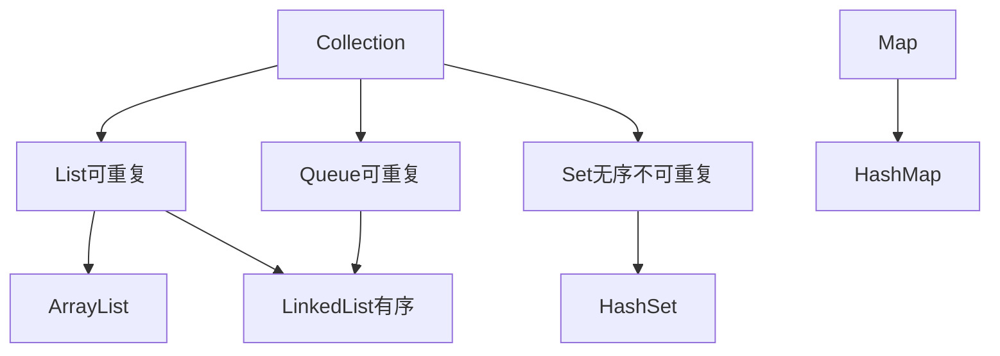

tags: #java #集合 #数组

## 数组部分

### 1、数组定义：类名[] 数组名 ,数组中存放该类型的数据；


### 2、二维数组：

- 二维数组的定义中，第一个括号必须有数值，不能为空，但可为0；


### 3、数组的初始化方式：

- 静态初始化

```java
int [] a = {1,2,5,7，3};    //静态初始化基本类型数组
User[] b = {
    new User(01,"张三"),
    new User(02,"李四"),
    new User(03,"王五")
}；                     //静态初始化引用类型数组；
```

- 动态初始化

```java
int[] a = new int[2];   //动态初始化数组，先分配空间；
a[0] = 1;//给数组元素赋值；
a[1] = 2;//给数组元素赋值；
```

- 默认初始化

```java
int[] a = new int[2];   //默认值：0,0；
boolean[] b = new boolean[2];   //默认值：false,false;
String[] s = new String[2];     //默认值：null,null;
```


### 4、二维数组的合法初始化：

```java
// 数据类型[][] 数组名;
int [][] table = new int[2][2];
int [][] table = new int[2][];
int [] table [] = new int[2][2];
int [] table [] = new int[2][];
```


### 5、数组和集合的区别：

(1)数组长度固定且不可变；

(2)集合可以在运行时动态变化；


## 集合部分

### 1、java中的集合框架体系结构：



---

### 2、集合部分简单介绍：

#### 集合


- 集合是将多个元素组成一个单元的对象；

- 类似于数组，但数组最大的缺点是：长度受到限制（一经创建，就不可再改变），并且只能存放相同数据类型的元素；

- 集合的长度没有限制，可以存放任意多的元素，而且元素的数据类型也可以不同；

- 集合还提供一系列操纵数据的方法，如存储、检索等等。


#### ArrayList

- ArrayList是长度可变的对象引用数组，称为动态数组；

- 随着元素的添加，元素数目的增大，数组容量也会随之自动扩展；

- 访问和遍历数组元素时，ArrayList的性能优越；

- ArrayList类继承了AbstractList类并实现了List接口。

实例代码

```java

package collectionsTest;

import java.util.ArrayList;
import java.util.Iterator;
import java.util.List;

public class ArrayListTest {

	public static void main(String[] args) {
		List<Integer> intList = new ArrayList<Integer>();
		intList.add(12);
		intList.add(9);
		intList.add(1);
		System.out.println("===========普通遍历==========");
		System.out.println("length:" + intList.size());
		for (Integer integer : intList) {
			System.out.println(integer);
		}
		intList.remove(2);// 移除索引为2的对象，即1
		System.out.println("===========迭代器遍历==========");
		System.out.println("length:" + intList.size());
		Iterator<Integer> intListIter = intList.iterator();
		while(intListIter.hasNext()) {
			System.out.println(intListIter.next());
		}
	}

}
```


#### LinkedList

- LinkedList类用于创建链表数据结构；

- 链表中元素的数量不受任何限制，可以随意地添加和删除；

- 与ArrayList相比，如果需要频繁地添加和删除元素，LinkedList的性能更加优越；

- LinkedList类继承了AbstractSequentialList类，并实现了List接口；


#### HashMap

- HashMap以键值对的形式存储元素；

- 对于HashMap来说，不存在索引，也就是说不可以通过索引来访问元素，只能通过键去访问值，如要快速检索元素的话，HashMap性能优越；

- 由于没有索引，所以HashMap中元素的存放是没有顺序的；

- HashMap类继承了AbstractMap类，并实现了Map接口。

#### 迭代器遍历List集合：

```java
Interator it = List.interator();
while(it.hasNext()){
    
}
```
在没有引入泛型的概念之前（Java SE 1.5引入泛型的概念），对象存入集合都变成Object，取出时需要类型转换；


### 3、ArrayList和LinkedList

- ArryList和LinkedList都实现了List接口，ArrayList的内存结构是数组，本质是顺序存储的线性表，插入和删除操作都会引起后续元素移动，效率低，但是随机访问效率高;

- LinkedList的内存结构是双向链表存储的，链式存储结构插入和删除效率高，不需要移动，但是随机访问效率低，需要从头开始向后依次访问 

### 4、HashTable和HashMap：

- HashMap和Hashtable两个类都实现了Map接口，二者保存K-V对（key-value对）;

- HashTable不允许null值(key和value都不可以),HashMap允许null值(key和value都可以);

- Hashtable的方法是Synchronize的，而HashMap不是，在多个线程访问Hashtable时，不需要自己为它的方法实现同步，而HashMap 就必须为之提供外同步;

- 由所有HashMap类的“collection 视图方法”所返回的迭代器都是快速失败的：在迭代器创建之后，如果从结构上对映射进行修改，除非通过迭代器本身的 remove 方法，其他任何时间任何方式的修改，迭代器都将抛出ConcurrentModificationException。Hashtable和HashMap的区别主要是前者是同步的，后者是快速失败机制保证.


### 5、 关于HashMap的一些说法：

a)  HashMap实际上是一个“链表散列”的数据结构，即数组和链表的结合体。HashMap的底层结构是一个数组，数组中的每一项是一条链表。

b)  HashMap的实例有俩个参数影响其性能： “初始容量” 和 装填因子。

c)  HashMap实现不同步，线程不安全。  HashTable线程安全

d)  HashMap中的key-value都是存储在Entry中的。

e)  HashMap可以存null键和null值，不保证元素的顺序恒久不变，它的底层使用的是数组和链表，通过hashCode()方法和equals方法保证键的唯一性

f)  解决冲突主要有三种方法：定址法，拉链法，再散列法。HashMap是采用拉链法解决哈希冲突的。

- **注**： 链表法是将相同hash值的对象组成一个链表放在hash值对应的槽位；

   - 用开放定址法解决冲突的做法是：当冲突发生时，使用某种探查(亦称探测)技术在散列表中形成一个探查(测)序列。 沿此序列逐个单元地查找，直到找到给定 的关键字，或者碰到一个开放的地址(即该地址单元为空)为止（若要插入，在探查到开放的地址，则可将待插入的新结点存人该地址单元）。

  - 拉链法解决冲突的做法是： 
     - 将所有关键字为同义词的结点链接在同一个单链表中 。若选定的散列表长度为m，则可将散列表定义为一个由m个头指针组成的指针数 组T[0..m-1]。凡是散列地址为i的结点，均插入到以T[i]为头指针的单链表中。T中各分量的初值均应为空指针。在拉链法中，装填因子α可以大于1，但一般均取α≤1。拉链法适合未规定元素的大小。

  

### 6、 Hashtable和HashMap的区别：

a)   继承不同。

```java
public class Hashtable extends Dictionary implements Map

public class HashMap extends  AbstractMap implements Map
```


b)  Hashtable中的方法是同步的，而HashMap中的方法在缺省情况下是非同步的。在多线程并发的环境下，可以直接使用Hashtable，但是要使用HashMap的话就要自己增加同步处理了。

c)  Hashtable 中， key 和 value 都不允许出现 null 值。 在 HashMap 中， null 可以作为键，这样的键只有一个；可以有一个或多个键所对应的值为 null 。当 get() 方法返回 null 值时，即可以表示 HashMap 中没有该键，也可以表示该键所对应的值为 null 。因此，在 HashMap 中不能由 get() 方法来判断 HashMap 中是否存在某个键， 而应该用 containsKey() 方法来判断。

d)  两个遍历方式的内部实现上不同。Hashtable、HashMap都使用了Iterator。而由于历史原因，Hashtable还使用了Enumeration的方式 。

e)  哈希值的使用不同，HashTable直接使用对象的hashCode。而HashMap重新计算hash值。

f)  Hashtable和HashMap它们两个内部实现方式的数组的初始大小和扩容的方式。HashTable中hash数组默认大小是11，增加的方式是old*2+1。HashMap中hash数组的默认大小是16，而且一定是2的指数。

- **注**：  HashSet子类依靠hashCode()和equal()方法来区分重复元素。
  - HashSet内部使用Map保存数据，即将HashSet的数据作为Map的key值保存，这也是HashSet中元素不能重复的原因。而Map中保存key值的,会去判断当前Map中是否含有该Key对象，内部是先通过key的hashCode,确定有相同的hashCode之后，再通过equals方法判断是否相同。

### 7、hashMap在单线程中使用大大提高效率，在多线程的情况下使用hashTable来确保安全；


- hashTable中使用synchronized关键字来实现安全机制，synchronized是对整张hash表进行锁定即让线程独享整张hash表，在安全同时造成了浪费；

- concurrentHashMap采用分段加锁的机制来确保安全。

### 8、 关于线程安全：


- TreeMap 线程不安全

- HashMap 线程不安全

- Hashtable 线程安全

- ArrayList 线程不安全

- LinkedList 线程不安全

- Vector 线程安全

- HashSet 线程不安全


### 9、遍历Map集合：

```java
Map<String,String> testmap = new HashMap<String,String >();
testmap.put("学号", "4120000002");
testmap.put("姓名", "林羽墨");
testmap.put("年龄", "24");
testmap.put("班级","04");
testmap.put("专业", "暖通");
System.out.println("-------------------第一种方式---------------------");

//第一种方法，最原始，最简单，效率也最低

System.out.println(testmap.toString());
System.out.println(testmap.keySet()+testmap.values().toString());

System.out.println("-------------------第二种方式---------------------");
for (String string : testmap.keySet()) {
    System.out.println(string+":"+testmap.get(string));
}
System.out.println("-------------------第三种方式---------------------");
//通过map迭代器输出
Iterator<Map.Entry<String, String>> iterator =testmap.entrySet().iterator();
while (iterator.hasNext()) {
    Map.Entry<String, String> infoEntry = iterator.next();
    System.out.println(infoEntry.getKey()+":"+infoEntry.getValue());
}
System.out.println("-------------------第四种方式---------------------");
//和第三种方法类似，但效率较高
for (Map.Entry<String,String> infoentry : testmap.entrySet()) {
    System.out.println(infoentry.getKey()+":"+infoentry.getValue());
}            
```
实例代码

```java
package collectionsTest;

import java.util.HashMap;
import java.util.Iterator;
import java.util.Map;
import java.util.Map.Entry;

public class MapTest {

	public static void main(String[] args) {
		Map<String, String> userPassword = new HashMap<String, String>();
		userPassword.put("admin", "adminp");
		userPassword.put("user", "userp");
		userPassword.put("123456", "654321p");
		
		// 获取key-value键值对，通过Map的entrySet()，返回Set<Map.Entry<K, V>>
		Iterator<Entry<String, String>> userPasswordIter = userPassword.entrySet().iterator();
		
		// 获取key的set集合，通过Map的keySet()，返回Set<K>
		Iterator< String> keyIter = userPassword.keySet().iterator();
		
		// 获取value的set集合，通过values的values(),返回Collection对象
		Iterator<String> valueIter = userPassword.values().iterator();
		
		System.out.println("================键值对=================");
		while (userPasswordIter.hasNext()) {
				System.out.println(userPasswordIter.next());
		}
		
		System.out.println("================键=================");
		while (keyIter.hasNext()) {
			System.out.println(keyIter.next());
		}
		
		System.out.println("================值=================");
		while (valueIter.hasNext()) {
			System.out.println(valueIter.next());
		}
	}
}
```