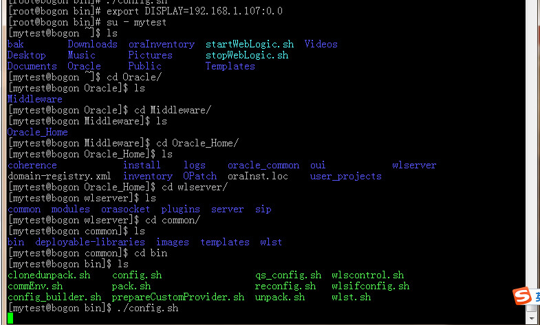
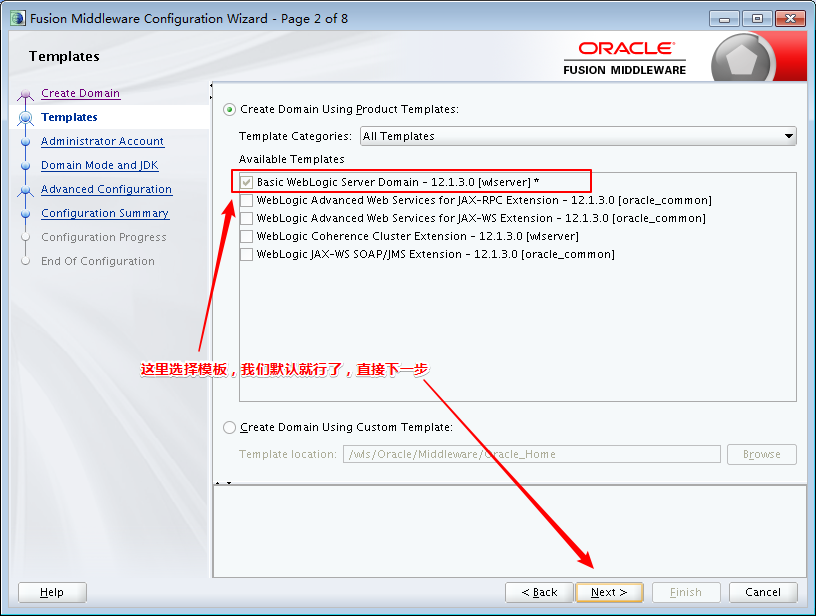
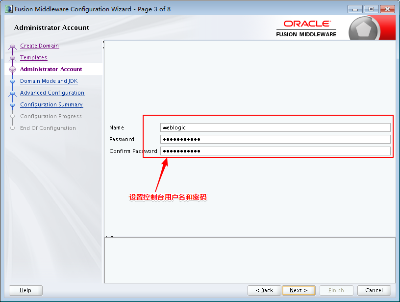
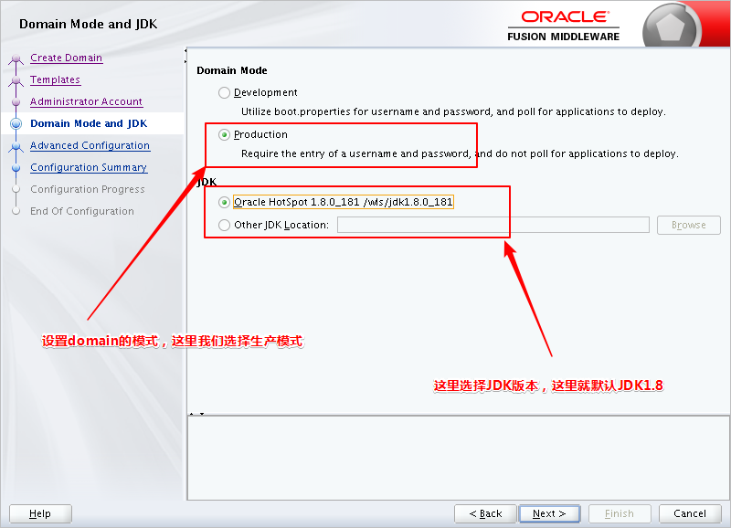
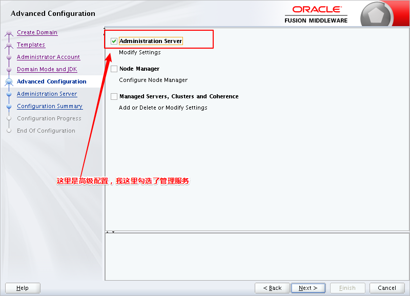
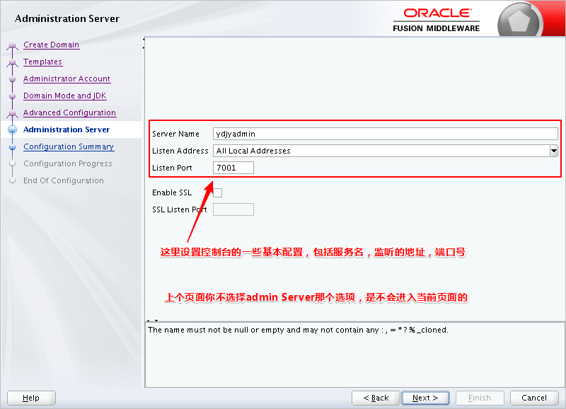
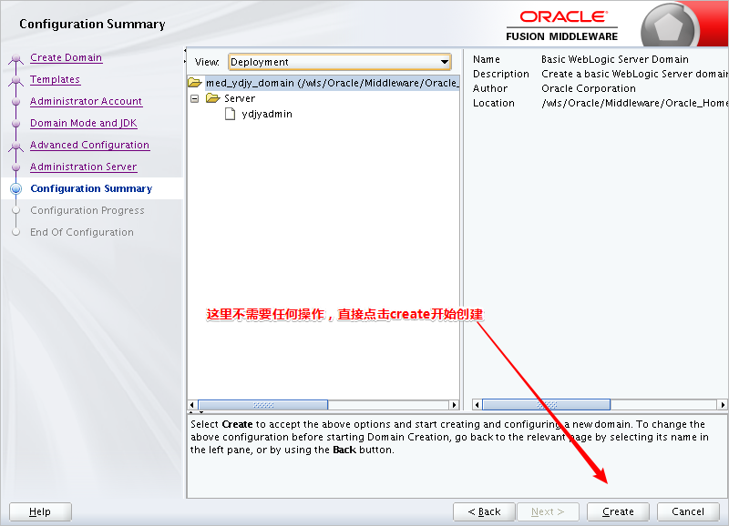
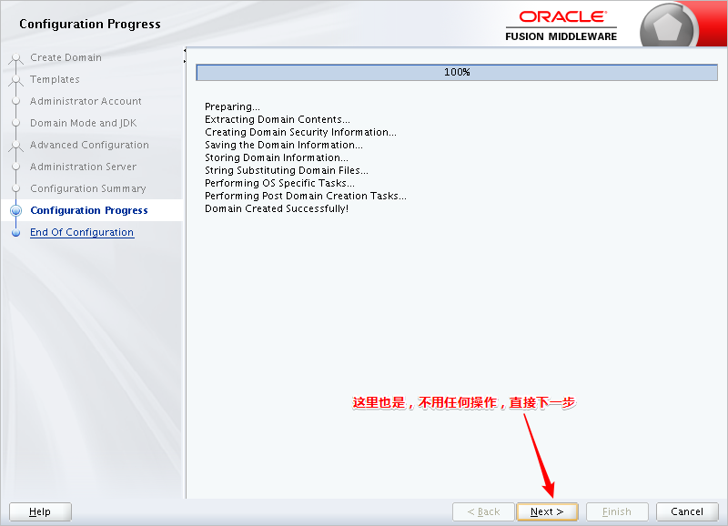

- 首先进入weblogic的安装目录，具体如下：
```sh
cd /wls/Oracle/Middleware/Oracle_Home/wlserver/common/bin
```

### 图形化创建
- 1、下载xmanager软件
- 2、使用远程连接工具链接linux操作系统
- 3、在模拟终端上执行如下命令：
```sh
export DISPLAY=localhost:10.0
```
见下图


- 4、执行如下命令：
```
./config.sh
```
**注意：** 第一次输入这个命令可能会报如下错误
```sh
Exception in thread "main" java.awt.AWTError: Can't connect to X11 window server using 'localhost:10.0' as the value of the DISPLAY variable.
	at sun.awt.X11GraphicsEnvironment.initDisplay(Native Method)
	at sun.awt.X11GraphicsEnvironment.access$200(X11GraphicsEnvironment.java:65)
	at sun.awt.X11GraphicsEnvironment$1.run(X11GraphicsEnvironment.java:115)
	at java.security.AccessController.doPrivileged(Native Method)
	at sun.awt.X11GraphicsEnvironment.<clinit>(X11GraphicsEnvironment.java:74)
	at java.lang.Class.forName0(Native Method)
	at java.lang.Class.forName(Class.java:264)
	at java.awt.GraphicsEnvironment.createGE(GraphicsEnvironment.java:103)
	at java.awt.GraphicsEnvironment.getLocalGraphicsEnvironment(GraphicsEnvironment.java:82)
	at sun.awt.X11.XToolkit.<clinit>(XToolkit.java:126)
	at java.lang.Class.forName0(Native Method)
	at java.lang.Class.forName(Class.java:264)
	at java.awt.Toolkit$2.run(Toolkit.java:860)
	at java.awt.Toolkit$2.run(Toolkit.java:855)
	at java.security.AccessController.doPrivileged(Native Method)
	at java.awt.Toolkit.getDefaultToolkit(Toolkit.java:854)
	at sun.swing.SwingUtilities2.getSystemMnemonicKeyMask(SwingUtilities2.java:2020)
	at javax.swing.plaf.basic.BasicLookAndFeel.initComponentDefaults(BasicLookAndFeel.java:1158)
	at javax.swing.plaf.metal.MetalLookAndFeel.initComponentDefaults(MetalLookAndFeel.java:431)
	at javax.swing.plaf.basic.BasicLookAndFeel.getDefaults(BasicLookAndFeel.java:148)
	at javax.swing.plaf.metal.MetalLookAndFeel.getDefaults(MetalLookAndFeel.java:1577)
	at javax.swing.UIManager.setLookAndFeel(UIManager.java:539)
	at javax.swing.UIManager.setLookAndFeel(UIManager.java:579)
	at javax.swing.UIManager.initializeDefaultLAF(UIManager.java:1349)
	at javax.swing.UIManager.initialize(UIManager.java:1459)
	at javax.swing.UIManager.maybeInitialize(UIManager.java:1426)
	at javax.swing.UIManager.getDefaults(UIManager.java:659)
	at javax.swing.UIManager.put(UIManager.java:988)
	at com.oracle.cie.common.ui.gui.GUIHelper.initPLAF(GUIHelper.java:51)
	at com.oracle.cie.wizard.internal.cont.GUIContext.<clinit>(GUIContext.java:296)
	at com.oracle.cie.wizard.internal.cont.GUITaskContainer.createTaskContext(GUITaskContainer.java:73)
	at com.oracle.cie.wizard.internal.cont.GUITaskContainer.createTaskContext(GUITaskContainer.java:21)
	at com.oracle.cie.wizard.internal.cont.AbstractTaskContainer.init(AbstractTaskContainer.java:32)
	at com.oracle.cie.wizard.internal.cont.GUITaskContainer.init(GUITaskContainer.java:21)
	at com.oracle.cie.wizard.internal.engine.WizardControllerEngine.loadTaskContainer(WizardControllerEngine.java:656)
	at com.oracle.cie.wizard.internal.engine.WizardControllerEngine.configureMode(WizardControllerEngine.java:595)
	at com.oracle.cie.wizard.internal.engine.WizardControllerEngine.init(WizardControllerEngine.java:172)
	at com.oracle.cie.wizard.WizardController.createWizardEnine(WizardController.java:110)
	at com.oracle.cie.wizard.WizardController.<init>(WizardController.java:28)
	at com.oracle.cie.wizard.WizardController.invokeWizardAndWait(WizardController.java:119)
	at com.oracle.cie.wizard.WizardController.main(WizardController.java:67)
```
报错没有关系，再次输入该命令就可以正常进入创建界面

- 5、然后会弹出和windows环境相同的界面，后续操作同windows
- 具体步骤
    - 第一步：<br>

    - 第二步<br>
    
    - 第三步<br>
    
    - 第四步<br>
    
    - 第五步<br>
    
    - 第六步<br>
    
    - 第七步<br>
    
- 至此，domain创建完成