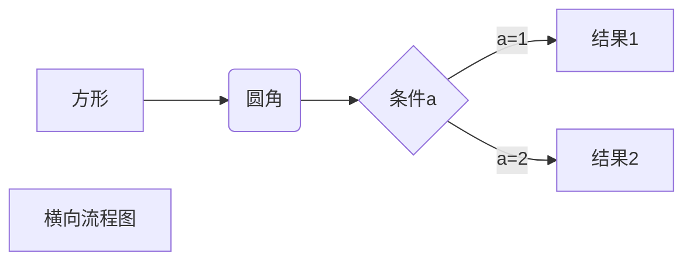
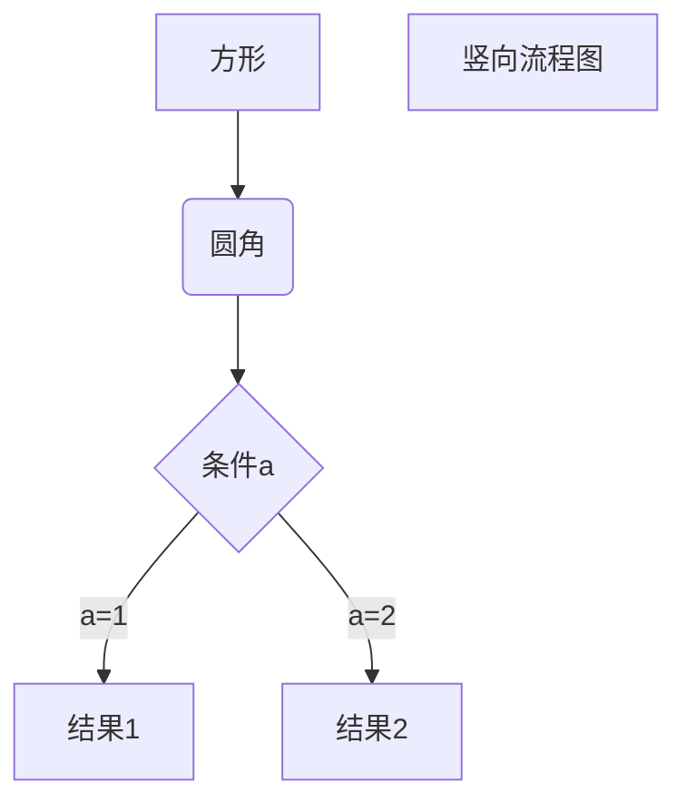
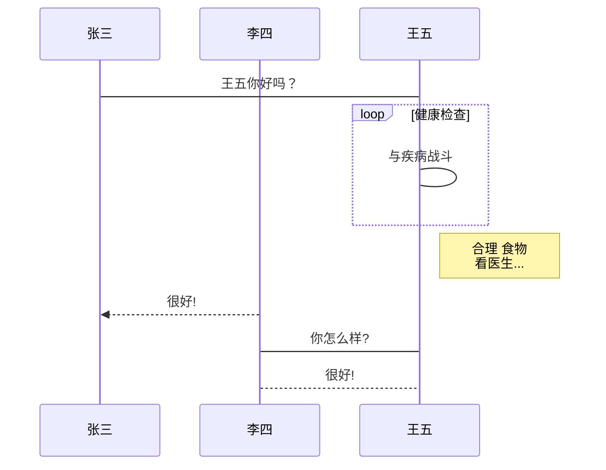

#markdown

---

[TOC]

### markdown是什么

- Markdown 是一种轻量级标记语言，它允许人们使用易读易写的纯文本格式编写文档。

- Markdown 语言在 2004 由约翰·格鲁伯（英语：John Gruber）创建。

- Markdown 编写的文档可以导出 HTML 、Word、图像、PDF、Epub 等多种格式的文档。

- Markdown 编写的文档后缀为 **.md**, **.markdown**

### markdown能干什么

Markdown 能被使用来撰写电子书，如：Gitbook。

当前许多网站都广泛使用 Markdown 来撰写帮助文档或是用于论坛上发表消息。例如：GitHub、简书、博客园、reddit、Diaspora、Stack Exchange、OpenStreetMap 、SourceForge等。

本篇博客就是通过markdown编写的，我用的编辑器是Typora，跨平台，可以实时预览，而且可以自定义主题样式，堪称完美，后面我会介绍。

## 如何使用

使用markdown来编写文档，非常方便，非常便捷，可以像纯文本一样保存和编辑，而且应用非常广泛。

### 编写标题

标题顾名思义，就是title，markdown中提供了6种标题，从1到6依次递减。具体的表示方法如下：

```
# 一级标题(h1)
## 二级标题(h2)
### 三级标题(h3)
#### 四级标题(h4)
##### 五级标题(h5)
###### 六级标题(h6)
```

解释一下，标题的样式是#加空格加标题内容，#数量越多，表示标题层级越低（字体越小），上面标题预览效果如下：


### Markdown段落

Markdown 段落没有特殊的格式，直接编写文字就好，**段落的换行是使用两个以上空格加上回车**。  

#### 字体

Markdown 可以使用以下几种字体：

```markdown
*斜体文本*
_斜体文本_
**粗体文本**
__粗体文本__
***粗斜体文本***
___粗斜体文本___
```

显示效果如下：


#### 分割线

你可以在一行中用三个以上的星号、减号、底线来建立一个分隔线，行内不能有其他东西。你也可以在星号或是减号中间插入空格。下面每种写法都可以建立分隔线：

```markdown
***

* * *

*****

- - -

----------
```

显示效果如下所示：


#### 删除线

如果段落上的文字要添加删除线，只需要在文字的两端加上两个波浪线 **~~** 即可，实例如下：

```
RUNOOB.COM
GOOGLE.COM
~~BAIDU.COM~~
```

显示效果如下：


#### 下划线

下划线可以通过 HTML 的 \<u\> 标签来实现：

```html
<u>带下划线文本</u>
```

先试下效果如下所示：


#### 脚注

脚注是对文本的补充说明。

Markdown 脚注的格式如下:

```markdown
[^要注明的文本]
```

以下实例演示了脚注的用法：

```
创建脚注格式类似这样 [^RUNOOB]。

[^RUNOOB]: 菜鸟教程 -- 学的不仅是技术，更是梦想！！！
```

演示效果如下：


### Markdown列表

Markdown 支持有序列表和无序列表。

无序列表使用星号(*****)、加号(**+**)或是减号(**-**)作为列表标记：

```
* 第一项
* 第二项
* 第三项

+ 第一项
+ 第二项
+ 第三项


- 第一项
- 第二项
- 第三项
```

演示效果：


有序列表使用数字并加上 **.** 号来表示，如：

```
1. 第一项
2. 第二项
3. 第三项
```

演示效果：


#### 列表嵌套

列表嵌套只需在子列表中的选项添加四个空格即可：

```
1. 第一项：
    - 第一项嵌套的第一个元素
    - 第一项嵌套的第二个元素
2. 第二项：
    - 第二项嵌套的第一个元素
    - 第二项嵌套的第二个元素
```

演示效果：


### Markdown区块

Markdown 区块引用是在段落开头使用 **>** 符号 ，然后后面紧跟一个**空格**符号：

```markdown
> 区块引用
> 菜鸟教程
> 学的不仅是技术更是梦想
```

显示结果如下：


另外区块是可以嵌套的，一个 **>** 符号是最外层，两个 **>** 符号是第一层嵌套，以此类推：

```
> 最外层
> > 第一层嵌套
> > > 第二层嵌套
```

演示效果如下：


#### 区块中使用列表

区块中使用列表实例如下：

```
> 区块中使用列表
> 1. 第一项
> 2. 第二项
> + 第一项
> + 第二项
> + 第三项
```

演示如下：


#### 列表中使用区块

如果要在列表项目内放进区块，那么就需要在 **>** 前添加四个空格的缩进。

区块中使用列表实例如下：

```
* 第一项
    > 菜鸟教程
    > 学的不仅是技术更是梦想
* 第二项
```

演示效果如下：


### Markdown代码

如果是段落上的一个函数或片段的代码可以用反引号把它包起来（**`**），例如：

```
`printf()` 函数
```

演示效果如下：

`printf()` 函数

#### 代码块

代码区块使用 **```** 包裹一段代码，并指定一种语言（也可以不指定）：

~~~javascript
```javascript
$(document).ready(function () {
    alert('RUNOOB');
});
```
~~~

显示效果如下：

```javascript
$(document).ready(function () {
    alert('RUNOOB');
});
```

### Markdown链接

链接使用方法如下：

```
[链接名称](链接地址)

或者

<链接地址>
```

例如：

```
这是一个链接 [云中志](https://www.cnblogs.com/caoleiCoding/)
```

显示效果如下：


直接使用链接地址：

```
<https://www.cnblogs.com/caoleiCoding/>
```

显示效果：


#### 高级链接

```
链接也可以用变量来代替，文档末尾附带变量地址：
这个链接用 1 作为网址变量 [Google][1]
这个链接用 runoob 作为网址变量 [Coding][Coding]
然后在文档的结尾为变量赋值（网址）

  [1]: http://www.google.com/
  [Coding]: https://www.cnblogs.com/caoleiCoding/
```

显示效果如下：


### Markdown图片

Markdown 图片语法格式如下：

```


```

- 开头一个感叹号 !
- 接着一个方括号，里面放上图片的替代文字
- 接着一个普通括号，里面放上图片的网址，最后还可以用引号包住并加上选择性的 'title' 属性的文字。

使用示例：

```


```

显示效果：


当然，你也可以像网址那样对图片网址使用变量:

```
这个链接用 1 作为网址变量 [博客园][1].
然后在文档的结尾为变量赋值（网址）

[1]: https://i-beta.cnblogs.com/assets/adminlogo.gif
```

显示效果：


Markdown 还没有办法指定图片的高度与宽度，如果你需要的话，你可以使用普通的  标签。

```

```

### Markdown表格

Markdown 制作表格使用 **|** 来分隔不同的单元格，使用 **-** 来分隔表头和其他行。

语法格式如下：

```
|  表头   | 表头  |
|  ----  | ----  |
| 单元格  | 单元格 |
| 单元格  | 单元格 |
```

显示效果如下：

| 表头   | 表头   |
| ------ | ------ |
| 单元格 | 单元格 |
| 单元格 | 单元格 |

#### 对齐方式

**我们可以设置表格的对齐方式：**

- **-:** 设置内容和标题栏居右对齐。
- **:-** 设置内容和标题栏居左对齐。
- **:-:** 设置内容和标题栏居中对齐。

示例如下：

```
| 左对齐 | 右对齐 | 居中对齐 |
| :-----| ----: | :----: |
| 单元格 | 单元格 | 单元格 |
| 单元格 | 单元格 | 单元格 |
```

显示效果如下：

| 左对齐 | 右对齐 | 居中对齐 |
| :-- | --: | :--: |
| 单元格 | 单元格 | 单元格  |
| 单元格 | 单元格 | 单元格  |

### Markdown高级技巧

#### 支持的 HTML 元素

不在 Markdown 涵盖范围之内的标签，都可以直接在文档里面用 HTML 撰写。

目前支持的 HTML 元素有：`<kbd>` `<b>` `<i>` `<em>` `<sup>` `<sub>` `<br>`等 ，如：

```
使用 <kbd>Ctrl</kbd>+<kbd>Alt</kbd>+<kbd>Del</kbd> 重启电脑
```

显示效果：


#### 转义

Markdown 使用了很多特殊符号来表示特定的意义，如果需要显示特定的符号则需要使用转义字符，Markdown 使用反斜杠转义特殊字符：

```
**文本加粗** 
\*\* 正常显示星号 \*\*
```

显示效果：


Markdown 支持以下这些符号前面加上反斜杠来帮助插入普通的符号：

```
\   反斜线
`   反引号
*   星号
_   下划线
{}  花括号
[]  方括号
()  小括号
#   井字号
+   加号
-   减号
.   英文句点
!   感叹号
```

#### 公式

当你需要在编辑器中插入数学公式时，可以使用两个美元符 $$ 包裹 TeX 或 LaTeX 格式的数学公式来实现。提交后，问答和文章页会根据需要加载 Mathjax 对数学公式进行渲染。如：

```
$$
\mathbf{V}_1 \times \mathbf{V}_2 =  \begin{vmatrix} 
\mathbf{i} & \mathbf{j} & \mathbf{k} \\
\frac{\partial X}{\partial u} &  \frac{\partial Y}{\partial u} & 0 \\
\frac{\partial X}{\partial v} &  \frac{\partial Y}{\partial v} & 0 \\
\end{vmatrix}
${$tep1}{\style{visibility:hidden}{(x+1)(x+1)}}
$$
```

显示效果：


#### 图表绘制

##### 横向流程图

```
```mermaid
graph LR
A[方形] -->B(圆角)
    B --> C{条件a}
    C -->|a=1| D[结果1]
    C -->|a=2| E[结果2]
    F[横向流程图]
​```
```

显示效果：



##### 竖向流程图
```
```mermaid
graph TD
A[方形] --> B(圆角)
    B --> C{条件a}
    C --> |a=1| D[结果1]
    C --> |a=2| E[结果2]
    F[竖向流程图]
​```
```

显示效果：



##### 标准流程图

```
```flow
st=>start: 开始框
op=>operation: 处理框
cond=>condition: 判断框(是或否?)
sub1=>subroutine: 子流程
io=>inputoutput: 输入输出框
e=>end: 结束框
st->op->cond
cond(yes)->io->e
cond(no)->sub1(right)->op
​```
```

显示效果：


##### 标准流程图（横向）

```
```flow
st=>start: 开始框
op=>operation: 处理框
cond=>condition: 判断框(是或否?)
sub1=>subroutine: 子流程
io=>inputoutput: 输入输出框
e=>end: 结束框
st(right)->op(right)->cond
cond(yes)->io(bottom)->e
cond(no)->sub1(right)->op
​```
```

演示效果：


##### UML时序图

```
```sequence
对象A->对象B: 对象B你好吗?（请求）
Note right of 对象B: 对象B的描述
Note left of 对象A: 对象A的描述(提示)
对象B-->对象A: 我很好(响应)
对象A->对象B: 你真的好吗？
​```
```

显示效果：


##### UML时序图（复杂）

```
```sequence
Title: 标题：复杂使用
对象A->对象B: 对象B你好吗?（请求）
Note right of 对象B: 对象B的描述
Note left of 对象A: 对象A的描述(提示)
对象B-->对象A: 我很好(响应)
对象B->小三: 你好吗
小三-->>对象A: 对象B找我了
对象A->对象B: 你真的好吗？
Note over 小三,对象B: 我们是朋友
participant C
Note right of C: 没人陪我玩
​```
```

显示效果：


##### UML标准时序图

```
```mermaid
%% 时序图例子,-> 直线，-->虚线，->>实线箭头
  sequenceDiagram
    participant 张三
    participant 李四
    张三->王五: 王五你好吗？
    loop 健康检查
        王五->王五: 与疾病战斗
    end
    Note right of 王五: 合理 食物 <br/>看医生...
    李四-->>张三: 很好!
    王五->李四: 你怎么样?
    李四-->王五: 很好!
​```
```

显示效果：



##### 甘特图样例

```
```mermaid
%% 语法示例
        gantt
        dateFormat  YYYY-MM-DD
        title 软件开发甘特图
        section 设计
        需求                      :done,    des1, 2014-01-06,2014-01-08
        原型                      :active,  des2, 2014-01-09, 3d
        UI设计                     :         des3, after des2, 5d
    未来任务                     :         des4, after des3, 5d
        section 开发
        学习准备理解需求                      :crit, done, 2014-01-06,24h
        设计框架                             :crit, done, after des2, 2d
        开发                                 :crit, active, 3d
        未来任务                              :crit, 5d
        耍                                   :2d
        section 测试
        功能测试                              :active, a1, after des3, 3d
        压力测试                               :after a1  , 20h
        测试报告                               : 48h
​```
```

显示效果：


#### 内容目录

使用[TOC]引用目录，例如本文目录：


#### 代办列表

 表示列表是否勾选状态（注意：[ ] 前后都要有空格）

```
- [ ] 不勾选
- [x] 勾选
```

效果如下

- [ ] 未完成
- [x] 完成