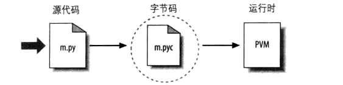
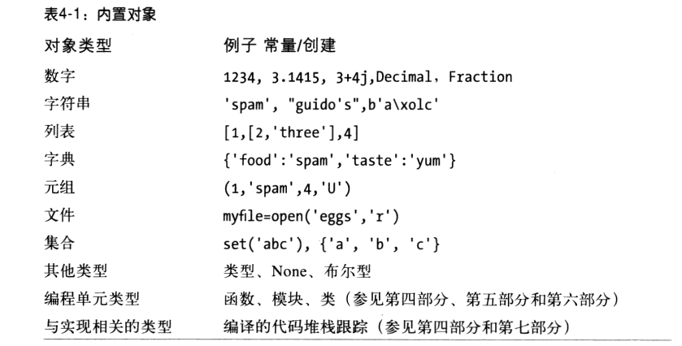

# python学习笔记

## 概论

### 第一章

#### python是什么

跨平台（平台无关性、可移植）、面向对象、脚本语言

#### 组成

python解释器、字节码编译(.pyc)、python虚拟机（PVM）



### 第二章

#### python命令行:交互模式:jack_o_lantern:

python可以通过命令行的形式运行代码：

```powershell
PS E:\workSpeace\learning_files\python> python
Python 3.7.6 (tags/v3.7.6:43364a7ae0, Dec 19 2019, 01:54:44) [MSC v.1916 64 bit (AMD64)] on win32
Type "help", "copyright", "credits" or "license" for more information.
>>> print('hello world')
hello world
>>> 'hello world'
'hello world'
>>> a = 'hello world'
>>> a
'hello world'
>>> 'adsfadsf!'*4
'adsfadsf!adsfadsf!adsfadsf!adsfadsf!'
>>>
```


#### 编写脚本

第一段脚本

```python
#!/usr/bin/env python
# first python script
import sys
print(sys.platform)
print(2**100)
s = 'spam!'
print(s * 8)
input('Press Enter to exit')
```

#### 脚本运行

##### 命令行方式

- python YourScriptName.py
- ./YourScriptName.py (unix环境需增加运行权限)
- 找到脚本双击运行

##### input技巧

- input()方法可以解决脚本运行一闪而过的问题，主要作用是让脚本停下来等待用户输入，按下回车后直接退出

- input方法可接受字符串，用于提示用户输入，例如：

  ```python
  input('Press Enter to exit！')
  ```

- 以字符串的形式为脚本返回读入的文本,例如，

  ```python
  nextinput=input()
  ```

#### 模块导入和重载

##### 关键字

- import
- from

##### 显要特性

- 属性

例如，如下模块，文件名myfile.py:

```python
#!usr/bin/env python
title="The Meaning of Life"
```

**使用方式：**

import

```powershell
>>> import myfile
>>> print(myfile.title)
The Meaning of Life
>>> myfile.title
'The Meaning of Life'
>>>
```

from

```python
PS E:\workSpeace\learning_files\python> python .\threenames.py
2020 love you
PS E:\workSpeace\learning_files\python> python
Python 3.7.6 (tags/v3.7.6:43364a7ae0, Dec 19 2019, 01:54:44) [MSC v.1916 64 bit (AMD64)] on win32
Type "help", "copyright", "credits" or "license" for more information.
>>> import threenames
2020 love you
>>> threenames.b, threenames.c
('love', 'you')
>>> from threenames import a,b,c
>>> a,c
('2020', 'you')
>>>
```

内置函数dir

```python
>>> dir(threenames)
['__builtins__', '__cached__', '__doc__', '__file__', '__loader__', '__name__', '__package__', '__spec__', 'a', 'b', 'c']
>>>
```

使用exec运行模块文件

```python
>>> exec(open('script1.py').read())
win32
1267650600228229401496703205376
spam!spam!spam!spam!spam!spam!spam!spam!
Press Enter to exit
>>>
```

**注意：**exec运行模块会覆盖当前代码同名变量的值，相当于会将需要运行的代码嵌入当前代码

### 第三章 python对象类型

#### 为什么要使用内置类型

- 内置对象使程序更容易编写
- 内置对象是拓展的组件
- 内置对象往往比定制的数据结构更有效率
- 内置对象是语言标准的一部分

#### python核心数据类型

| 对象类型         | 例子 常量/创建                         |
| ---------------- | -------------------------------------- |
| 数字             | 1234， 3.1415, 3+4j, Decimal, Fraction |
| 字符串           | 'spam', "guido's", b'a\xolc'           |
| 列表             | [1,[2m 'three'],4]                     |
| 字典             | {'food':'spam', 'taste':'yum'}         |
| 元组             | (1, 'spam', 4, 'U')                    |
| 文件             | myfile = open('eggs', 'r')             |
| 集合             | set('abc'), {'a','b','c'}              |
| 其他类型         | 类型、None、布尔型                     |
| 编程单元类型     | 函数、模块、类                         |
| 与实现相关的类型 | 编译的代码堆栈跟踪                     |



#### 数字

**运算**：加（+）、减（-）、乘（*）、除（/）、乘方（**）

```python
>>> import math
>>> math.pi
3.141592653589793
>>> math.sqrt
<built-in function sqrt>
>>> math.sqrt(3)
1.7320508075688772
>>> import random
>>> random.random()
0.31100155249422845
>>> random.random()
0.9442193408910846
>>> random.choice([1,2,3,4,5.6])
1
```

#### 字符串

用来记录文本信息。严格来说，字符串是单个字符的序列。不可变

##### 序列的操作

个人理解，感觉就行java中的数组

```python
>>> s = 'love you'
>>> len(s)
8
>>> s[0]
'l'
>>> s[2]
'v'
>>> s[-1]
'u'
>>> s[-2]
'o'
>>> s[1:4]
'ove'
>>> s[1:]
'ove you'
>>> s[1]
'o'
>>> s[0:3]
'lov'
>>> s[:3]
'lov'
>>> s[:-1]
'love yo'
>>> s[:]
'love you'
>>> s + ' 2020'
'love you 2020'
>>> s * 8
'love youlove youlove youlove youlove youlove youlove youlove you'
```

##### 类型特定的方法

```python
>>> s = 'i love you'
>>> s
'i love you'
>>> s.find('love')
2
>>> s
'i love you'
>>> s.replace('you','all of you')
'i love all of you'
>>> s
'i love you'
>>> line = 'aaa,bbb,ccc,ddd'
>>> line.split(',')
['aaa', 'bbb', 'ccc', 'ddd']
>>> s
'i love you'
>>> s.upper()
'I LOVE YOU'
>>> s.isalpha()
False
>>> line = 'aaa,bbbb,vvvv,ddd\n'
>>> line
'aaa,bbbb,vvvv,ddd\n'
>>> line = line.rstrip()
>>> line
'aaa,bbbb,vvvv,ddd'
```

字符串格式化

```python
>>> '%s, eggs,and %s' %('spam', 'SPAM!')
'spam, eggs,and SPAM!'
>>> '{0}, eggs, and {1}'.format('spam','SPAM!')
'spam, eggs, and SPAM!'
```

#### 获取帮助

**显示所有属性**

假如s为字符串

```python
>>> dir(s)
['__add__', '__class__', '__contains__', '__delattr__', '__dir__', '__doc__', '__eq__', '__format__', '__ge__', '__getattribute__', '__getitem__', '__getnewargs__', '__gt__', '__hash__', '__init__', '__init_subclass__', '__iter__', '__le__', '__len__', '__lt__', '__mod__', '__mul__', '__ne__', '__new__', '__reduce__', '__reduce_ex__', '__repr__', '__rmod__', '__rmul__', '__setattr__', '__sizeof__', '__str__', '__subclasshook__', 'capitalize', 'casefold', 'center', 'count', 'encode', 'endswith', 'expandtabs', 'find', 'format', 'format_map', 'index', 'isalnum', 'isalpha', 'isascii', 'isdecimal', 'isdigit', 'isidentifier', 'islower', 'isnumeric', 'isprintable', 'isspace', 'istitle', 'isupper', 'join', 'ljust', 'lower', 'lstrip', 'maketrans', 'partition', 'replace', 'rfind', 'rindex', 'rjust', 'rpartition', 'rsplit', 'rstrip', 'split', 'splitlines', 'startswith', 'strip', 'swapcase', 'title', 'translate', 'upper', 'zfill']
```

**获取帮助信息**

```python
>>> help(s.replace)
Help on built-in function replace:

replace(old, new, count=-1, /) method of builtins.str instance
    Return a copy with all occurrences of substring old replaced by new.

      count
        Maximum number of occurrences to replace.
        -1 (the default value) means replace all occurrences.

    If the optional argument count is given, only the first count occurrences are      replaced.
```

##### 字符串的其他方法

```python
>>> ord('\n')
10
>>> ord('a')
97
>>> msg = """aaaaaaa
... bbbbb'''dfsdfdf""jkkkkk'bkjkjk
... cccccccccc"""
>>> msg
'aaaaaaa\nbbbbb\'\'\'dfsdfdf""jkkkkk\'bkjkjk\ncccccccccc'
```

##### 正则表达式

```python
>>> import re
>>> match = re.match('Hello[ \t]*(.*)world','Hello   Python world')
>>> mactch.group(1)
Traceback (most recent call last):
  File "<stdin>", line 1, in <module>
NameError: name 'mactch' is not defined
>>> match.group(1)
'Python '
>>> match = re.match('/(.*)/(.*)/(.*)', '/usr/home/lumberjack')
>>> match.groups()
('usr', 'home', 'lumberjack')
>>> match = re.match('Hello[ \t]*(.*)world','Hello   Python world')
>>> mactch.groups()
Traceback (most recent call last):
  File "<stdin>", line 1, in <module>
NameError: name 'mactch' is not defined
>>> match.groups()
('Python ',)
```

#### 列表

最通用的序列、没有固定大小（大小可变）、有序集合

##### 序列操作

```python
>>> l = [123, 'spa', 1.23]
>>> len(l)
3
>>> l[0]
123
>>> l[9]
Traceback (most recent call last):
  File "<stdin>", line 1, in <module>
IndexError: list index out of range
>>> l[:-1]
[123, 'spa']
>>> l + [4, 5, 6]
[123, 'spa', 1.23, 4, 5, 6]
>>> l
[123, 'spa', 1.23]
```

##### 类型特定的操作

```python
>>> l.append('NI')
>>> l
[123, 'spa', 1.23, 'NI']
>>> l.pop(2)
1.23
>>> l
[123, 'spa', 'NI']
>>> m = ['bb','dd','zz','cc','aa']
>>> m.sort()   # 排序，默认升序
>>> m
['aa', 'bb', 'cc', 'dd', 'zz']
>>> m.reverse() #反转
>>> m
['zz', 'dd', 'cc', 'bb', 'aa']
```

##### 边界检查

```python
>>> l
[123, 'spa', 'NI']
>>> l[3]
Traceback (most recent call last):
  File "<stdin>", line 1, in <module>
IndexError: list index out of range
>>> l[3] = '1'
Traceback (most recent call last):
  File "<stdin>", line 1, in <module>
IndexError: list assignment index out of range
```

##### 嵌套

```python
>>> m = [[1,2,3],[4,5,6],[7,8,9]]
>>> m
[[1, 2, 3], [4, 5, 6], [7, 8, 9]]
>>> m[1]
[4, 5, 6]
>>> m[1][2]
6
```

##### 列表解析

```python
>>> col2 = [row[1] for row in m]
>>> col2
[2, 5, 8]
>>> m
[[1, 2, 3], [4, 5, 6], [7, 8, 9]]
>>> col3 = [row[2] for row in m]
>>> col3
[3, 6, 9]
>>> [row[1] + 1 for row in m]
[3, 6, 9]
>>> [row[1] for row in m if row[1]%2 == 0]
[2, 8]
>>> diag = [m[i][i] for i in[0, 1, 2]]
>>> diag
[1, 5, 9]
>>> doubles = [c * 2 for c in 'spam']
>>> doubles
['ss', 'pp', 'aa', 'mm']
```

解析为列表

```python
>>> list(map(sum, m))
[6, 15, 24]
```

解析为集合和字典

```python
>>> {sum(row) for row in m}
{24, 6, 15}
>>> {i:sum(m[i]) for i in range(3)}
{0: 6, 1: 15, 2: 24}
```

列表、集合和字典都可以通过解析来创建

- 列表允许重复数据
- 集合不允许有重复数据
- 字典键名不能重复，如果重复，则会被最后一个键对应的值覆盖

```python
>>> [ord(x) for x in 'spaaam']
[115, 112, 97, 97, 97, 109]
>>> {ord(x) for x in 'spaaam'}
{112, 97, 115, 109}
>>> {x:ord(x) for x in 'spaaam'}
{'s': 115, 'p': 112, 'a': 97, 'm': 109}
>>> m = {'a':45,'b':45,'c':35}
>>> m
{'a': 45, 'b': 45, 'c': 35}
>>> m = {'a':45,'b':45,'c':35,'c':45}
>>> m
{'a': 45, 'b': 45, 'c': 45}
>>> m = {'a':45,'b':45,'c':35,'c':45,'c':55}
>>> m
{'a': 45, 'b': 45, 'c': 55}
```

#### 字典

键值对、映射类型，具有可变性

##### 映射操作

```python
>>> d = {'food':'spam','quantity':4,'color':'pink'}
>>> d
{'food': 'spam', 'quantity': 4, 'color': 'pink'}
>>> d['food']
'spam'
>>> d['quantity'] += 1
>>> d
{'food': 'spam', 'quantity': 5, 'color': 'pink'}
>>> d['quantity'] + 1
6
```

**创建字典并赋值**

```python
>>> d = {}
>>> d['name'] = 'Bob'
>>> d['job'] = 'dev'
>>> d['age'] = 40
>>> d
{'name': 'Bob', 'job': 'dev', 'age': 40}
>>> print(d['name'])
Bob
```

##### 嵌套

```python
>>> rec = {'name':{'first':'Bob','last':'Smith'},'job':['dev','mgr'],'age':50}
>>> rec
{'name': {'first': 'Bob', 'last': 'Smith'}, 'job': ['dev', 'mgr'], 'age': 50}
>>> rec['name']
{'first': 'Bob', 'last': 'Smith'}
>>> rec['name']['last']
'Smith'
>>> rec['job']
['dev', 'mgr']
>>> rec['job'][-1]
'mgr'
>>> rec['job'].append('janitor')
>>> rec
{'name': {'first': 'Bob', 'last': 'Smith'}, 'job': ['dev', 'mgr', 'janitor'], 'age': 50}
```

在python中，当最后一次引用对象后（例如，将这个变量用其他的值进行赋值），这个对象所占用的内存空间都将会自动清理掉：

```python
>>> rec = 0
>>> rec
0
```

##### 键的排序：for循环

```python
>>> d = {'a':1, 'd':2, 'c':3}
>>> Ks.sort()
>>> Ks = list(d.keys())
>>> ks.sort()
Traceback (most recent call last):
  File "<stdin>", line 1, in <module>
NameError: name 'ks' is not defined
>>> Ks.sort()
>>> Ks
['a', 'c', 'd']
>>> for key in Ks:
...     print(key, '=>',d[key])
...
a => 1
c => 3
d => 2
# 排序后输出
>>> for key in sorted(d):
...     print(key, '=>',d[key])
...
a => 1
c => 3
d => 2
>>> d
{'a': 1, 'd': 2, 'c': 3}
```

while循环

```python
>>> x = 4
>>> while x > 0:
...     print('spam!' * x)
...     x -= 1
...
spam!spam!spam!spam!
spam!spam!spam!
spam!spam!
spam!
```

##### 迭代和优化

```python
>>> squares = [x ** 2 for x in [1, 2, 3, 4, 5]]
>>> squares
[1, 4, 9, 16, 25]
>>> squares = []
>>> for x in [1, 2, 3, 4, 5]:
...     squares.append(x ** 2)
...
>>> squares
[1, 4, 9, 16, 25]
```

##### if测试

```python
>>> d
{'a': 1, 'd': 2, 'c': 3}
>>> d['e'] = '99'
>>> d
{'a': 1, 'd': 2, 'c': 3, 'e': '99'}
>>> d['f']
Traceback (most recent call last):
  File "<stdin>", line 1, in <module>
KeyError: 'f'
>>> 'f' in d
False
>>> if ont 'f' in d:
  File "<stdin>", line 1
    if ont 'f' in d:
             ^
SyntaxError: invalid syntax
>>> if not 'f' in d:
...     print('missing')
...
missing
>>> value = d.get('x', 0)
>>> value
0
>>> d
{'a': 1, 'd': 2, 'c': 3, 'e': '99'}
>>> value = d['x'] if 'x' in d else 0
>>> value
0
>>> value = d.get('a', 0)
>>> d
{'a': 1, 'd': 2, 'c': 3, 'e': '99'}
>>> value = d.get('a')
>>> valuse
Traceback (most recent call last):
  File "<stdin>", line 1, in <module>
NameError: name 'valuse' is not defined
>>> value
1
```

#### 元组

不可变列表

```python
>>> t = (1,2,3,4,5)
>>> len(t)
5
>>> t + (6,7)
(1, 2, 3, 4, 5, 6, 7)
>>> t
(1, 2, 3, 4, 5)
>>> t[0]
1
>>> t.index(4)
3
>>> t.count(4)
1
>>> t[0] = 2
Traceback (most recent call last):
  File "<stdin>", line 1, in <module>
TypeError: 'tuple' object does not support item assignment
```

支持嵌套、支持混合类型

```python
>>> t.append(6)
Traceback (most recent call last):
  File "<stdin>", line 1, in <module>
AttributeError: 'tuple' object has no attribute 'append'
>>> t = ('spam', 3.0, [11, 22, 33])
>>> t[1]
3.0
>>> t[2][1]
22
```

#### 文件

写

```python
>>> f = open('data.txt', 'w')
>>> f.write('Hello\n')
6
>>> f.write('world\n')
6
>>> f.write('wuhan\n')
6
>>> f.write('hold on\n')
8
>>> f.close()
```

读

```python
>>> f = open('data.txt')
>>> text = f.read()
>>> text
'Hello\nworld\nwuhan\nhold on\n'
>>> print(text)
Hello
world
wuhan
hold on

>>> text.split()
['Hello', 'world', 'wuhan', 'hold', 'on']
```

```python
>>> dir(f)
['_CHUNK_SIZE', '__class__', '__del__', '__delattr__', '__dict__', '__dir__', '__doc__', '__enter__', '__eq__', '__exit__', '__format__', '__ge__', '__getattribute__', '__getstate__', '__gt__', '__hash__', '__init__', '__init_subclass__', '__iter__', '__le__', '__lt__', '__ne__', '__new__', '__next__', '__reduce__', '__reduce_ex__', '__repr__', '__setattr__', '__sizeof__', '__str__', '__subclasshook__', '_checkClosed', '_checkReadable', '_checkSeekable', '_checkWritable', '_finalizing', 'buffer', 'close', 'closed', 'detach', 'encoding', 'errors', 'fileno', 'flush', 'isatty', 'line_buffering', 'mode', 'name', 'newlines', 'read', 'readable', 'readline', 'readlines', 'reconfigure', 'seek', 'seekable', 'tell', 'truncate', 'writable', 'write', 'write_through', 'writelines']
>>> dir(f.seek)
['__call__', '__class__', '__delattr__', '__dir__', '__doc__', '__eq__', '__format__', '__ge__', '__getattribute__', '__gt__', '__hash__', '__init__', '__init_subclass__', '__le__', '__lt__', '__module__', '__name__', '__ne__', '__new__', '__qualname__', '__reduce__', '__reduce_ex__', '__repr__', '__self__', '__setattr__', '__sizeof__', '__str__', '__subclasshook__', '__text_signature__']
```

读取二进制文件

```python
>>> data = open('data.bin', 'rb').read()
>>> data
b'Hello\r\nworld\r\nwuhan\r\nhold on\r\n'
>>> data[4:8]
b'o\r\nw'
```

##### 其他文件类工具

管道、先进先出队列、套接字、通过键访问文件、对象持久、基于描述符的文件、关系数据库和面向对象数据库接口等

#### 其他核心类型

##### set 

```python
>>> x = set('spam')
>>> y = {'h','a','m'}
>>> x,y
({'a', 'p', 's', 'm'}, {'a', 'm', 'h'})
>>> x & y
{'a', 'm'}
>>> x | y
{'s', 'm', 'h', 'a', 'p'}
>>> x - y
{'p', 's'}
>>> {x ** 2 for x in[1, 2, 3, 4]}
{16, 1, 4, 9}
```

##### 其他数值类型

分数、十进制

```python
>>> 1/3
0.3333333333333333
>>> (2/3) + (1/2)
1.1666666666666665
>>> import decimal
>>> d = decimal.Decimal('3.141')
>>> d + 2
Decimal('5.141')
>>> decimal.getcontext().prec = 2
>>> decimal.Decimal('1.00')/decimal.Decimal('3.00')
Decimal('0.33')
>>> from fractions import Fraction
>>> f = Fraction(2, 4) # 分数
>>> f
Fraction(1, 2)
>>> f + 1
Fraction(3, 2)
>>> f + Fraction(1, 2)
Fraction(1, 1)
>>> f = Fraction(2, 3)
>>> f
Fraction(2, 3)
>>> f + 1
Fraction(5, 3)
>>> f + Fraction(1, 2)
Fraction(7, 6)
```

##### 布尔值、None

布尔

```python
>>> 1<2
True
>>> 1<2,2>1
(True, True)
>>> 1<2,1>1
(True, False)
```

None

```python
>>> x = none
Traceback (most recent call last):
  File "<stdin>", line 1, in <module>
NameError: name 'none' is not defined
>>> x = None
>>> x
>>> prtint(x)
Traceback (most recent call last):
  File "<stdin>", line 1, in <module>
NameError: name 'prtint' is not defined
>>> print(x)
None
>>> L = [None] * 100
>>> L
[None, None, None, None, None, None, None, None, None, None, None, None, None, None, None, None, None, None, None, None, None, None, None, None, None, None, None, None, None, None, None, None, None, None, None, None, None, None, None, None, None, None, None, None, None, None, None, None, None, None, None, None, None, None, None, None, None, None, None, None, None, None, None, None, None, None, None, None, None, None, None, None, None, None, None, None, None, None, None, None, None, None, None, None, None, None, None, None, None, None, None, None, None, None, None, None, None, None, None, None]
>>>
```

###### 如何破坏代码的灵活性

```python
>>> type(L)
<class 'list'>
>>> type(type(L))
<class 'type'>
>>> if type(L) == type([]):
...     print('yes')
...
yes
>>> if isinstance(L, list):
...     print('yes')
...
yes
>>> if isinstance(L, list):
...     print('yes')
...
yes
>>> if type(L) == list:
...    print('yes')
...
yes
```

##### 用户定义的类

```python
>>> class Worker:
...     def __init__(self, name, pay):
...         self.name = name
...         self.pay = pay
...     def lastName(self):
...         return self.name.split()[-1]
...     def giveRaise(self, percent):
...         self.pay *= (1.0 + percent)
...
>>> bob = Worker('Bob Smith', 50000)
>>> sue = Worker('Sue Jones', 60000)
>>> bob.lastName()
'Smith'
>>> sue.lastName()
'Jones'
>>> sue.giveRaise(.10)
>>> sue.pay
66000.0
```

### 第四章 数字

#### 数字类型

##### 数字类型的完整工具

- 整数和浮点数
- 复数
- 固定精度的十进制数
- 有理分数
- 集合
- 布尔类型
- 无穷的的整数精度
- 各种数字内置函数和模块

#### 数字常量

基本数字常量

| 数字                                | 常量                                    |
| ----------------------------------- | --------------------------------------- |
| 1234，-24，0，9999999999999         | 整数（无穷大小）                        |
| 1.23，1.，3.14e-10，4E210，4.0e+210 | 浮点数                                  |
| 0177，0x9ff，0b101010               | Python2.6中的八进制、16进制和二进制常量 |
| 0o77，0x9ff，0b101010               | Python3.0中的八进制、16进制和二进制常量 |
| 3+4j，3.0+4.0j，3J                  | 复数常量                                |

**整数和浮点数常量：**整数以十进制数字的字符串写法出现。浮点数带一个小数点，也可以加上一个科学计数标志e或者E。如果编写一个带小数点或者幂的数字，Python会将它变成一个浮点数对象，并在运算中启用浮点数的运算法则。

**2.6中的整数：**一般整数（32位）和长整数（无穷精度）。当整数值超过32位的时候会自动转换为长整数。在整数末尾加上l或者L，会将该整数墙砖为长整数。

**3.0中的整数：**一个单独的类型。将一般整数和长整数类型合二为一，默认为无穷精度。

**十六进制数、八进制和二进制常量：**十六进制数以0x或者0X开头，后面接十六进制的数字0\~9和A\~F，以16为基数；八进制以0o或者0O开头（0和小写或者大小字母“o”），后面接着数字0~7构成的字符串

**复数：**实部+虚部，虚部是以j或者J结尾。也可以通过内置函数complex(real, imag)来创建复数

**编写其他的数字类型：**可以通过调用导入的模块中的函数来创建

#### 内置数学工具和扩展

**表达式操作符**

+、-、*、/、>>、**、&等

**内置数字函数**

pow、abs、round、int、hex、bin等

**公共模块**

random、math等

#### Python表达式操作符

| 操作符                  | 描述                           |
| ----------------------- | ------------------------------ |
| yield x                 | 生成器函数发送协议             |
| lambda args: expression | 生成匿名函数                   |
| x if y else z           | 三元选择表达式                 |
| x or y                  | 逻辑或（只有x为假，才会计算y） |
| x and y | 逻辑与（只有x为真，才会计算y） |
| not x | 逻辑非 |
| x in y,x not in y | 成员关系（可迭代对象、集合） |
| x is y,x is not y | 对象实体测试 |
| x < y, x <= y, x > y, x>=y, x == y, x != y | 大小笔记，集合子集和超集值相等性操作符 |
| x \| y | 位或，集合并集 |
| x ^ y | 位异或，集合对称差 |
| x & y | 位与，集合交集 |
| x << y, x >> y | 左移或右移y位 |
| x + y, x - y | 加法/合并，减法，集合差集 |
| x * y, x % y, x / y, x // y | 乘法/重复，余数/格式化，除法：真除法或floor除法 |
| -x, +x | 一元减法，识别 |
| ~x | 按位求补（取反） |
| x ** y | 幂运算 |
| x[i] | 索引（序列、映射及其他）点号取属性性运算，函数调用 |
| x[i:j:k] | 分片 |
| x(...) | 调用（函数、方法、类及其他可调用的） |
| x.attr | 属性引用 |
| (...) | 元组，表达式，生成器表达式 |
| [...] | 列表，列表解析 |
| {...} | 字典、集合、集合和字典解析 |

**注意：**

- 2.6中，值不相等可以写成X != Y或者X <> Y。3.0中，后着已经被移除。
- 2.6中，一个后引号表达式'X'和repr(X)的作用相同，转换对象以显示字符串。由于不好理解，3.0中删除了这个表达式，使用更容易理解的str和repr内置函数
- 