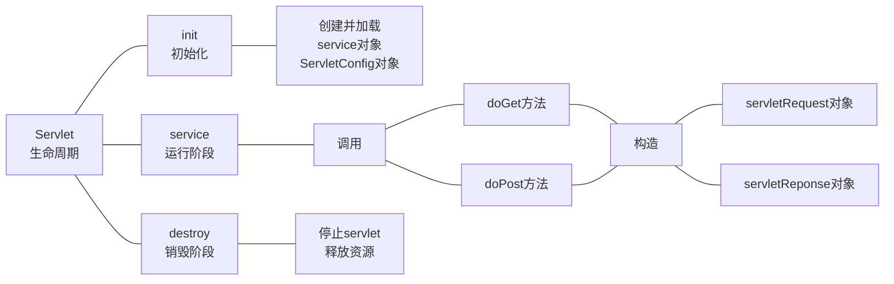

# servlet生命周期

```mermaid
graph LR
 A[Servlet<br> 生命周期]
    A --- B[init<br> 初始化] --- E[创建并加载<br> service对象<br> ServletConfig对象]
    A --- C[service<br> 运行阶段] --- F[调用]
    A --- D[destroy<br> 销毁阶段]
    
    F --- G[doGet方法]
    F --- H[doPost方法]
    
    I[构造]
    
    G --- I
    H --- I
    
    I --- J[servletRequest对象]
    I --- K[servletReponse对象]
    
    D --- L[停止servlet<br> 释放资源]
```

