### 什么？你还不会创建spring项目！！！

### ——手动创建spring项目

作为一个爱码仕，想必你已经对spring框架有了很多的了解和认识，或者至少说spring应该已经在你的耳朵了磨出了茧子，那么你有自己手动创建过spring的项目吗？本次的文章，我们要讨论的就是手动创建spring项目的问题，下面我会一步一步尽可能详细地描述spring项目的各个步骤，如果有那一块你觉得描述的不合适，或者你有更好的见解和认知，欢迎留言  ^_^

#### 本机环境

- OS：win 10
- IDE：IDEA 2018.1
- 框架：spring 5.0.8
- 依赖管理：maven

#### 1、创建maven项目

- 创建项目

  这里创建的是maven项目，关于maven这里不做详细介绍，后面可以考虑出一篇关于maven的文章

  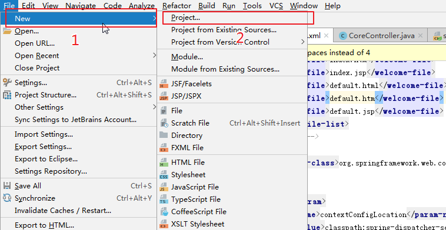

- 选择maven的模板

  这里选择的是maven-archetype-webapp，因为我们创建的web应用，其他的模板没有详细了解过，有兴趣的同学可以自己去查下资料

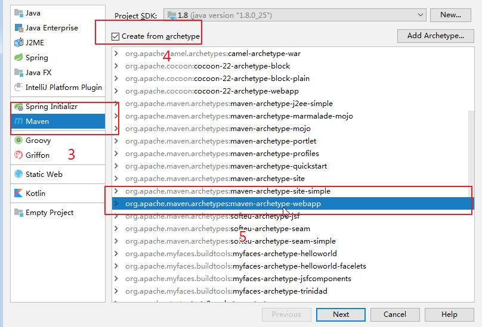

- 设置包名
  - GroupId：项目的公有前缀，一般指定为公司一级域名反写，比如com.baidu。如果你自己观察过maven的pom.xml文件的话，你会发现`<dependency>`标签下有个标签就有这个标签，对一个公司来说，这个值是不会轻易改变的，maven项目中jar包引用就是根据这个标签和包名来定位的，如果改变了，在其他项目用到这个包的时候，就要相应的改变，当然也不绝对，如果你不想通过工具来将本项目最后打成的jar安装到公司的仓库里，那就不影响。
  - ArtifactId：项目特有的名字，也就是包名，一般来说要唯一。这个标签也是maven里面的，用于定位jar包
  - Version：项目版本号，这个标签也是maven里面的，用于定位jar包

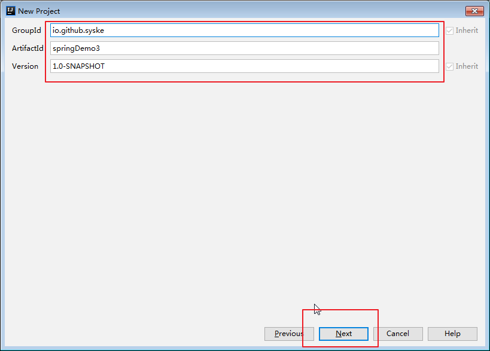

- 设置项目的maven的配置信息、maven仓库路径（会从maven配置文件中获取）

  首先要确保你本机有maven，maven home directory就是你本地maven的安装路径；User settings file指的是你maven下面的配置，里面可以设置本地、远程仓库，如果没有更改可以不设置；local repository设置的是本地仓库，也就是jar包存放路径，如果在配置文件里面设置了，这里不用管。

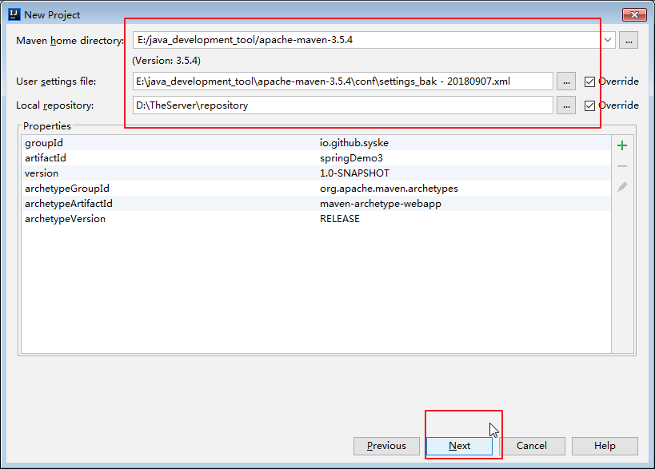

- 设置项目名、项目保存路径

  这里就不再详细说了，根据字面意思大家都知道了

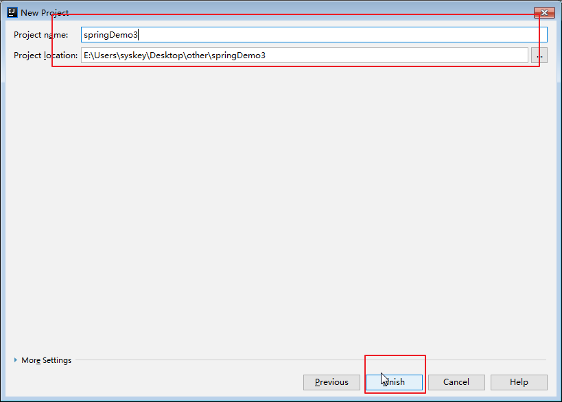

- 创建各个文件夹

  - 在src文件夹下创建main文件夹、test文件夹

  - 在main文件夹下创建java文件夹，并标记为sources Root

  - 在main文件夹下创建resources文件夹，并标记为resources Root

  - 在test文件夹下创建java文件夹，并标记为test sources Root

  - 在test文件夹下创建resources文件夹，并标记为test resources Root

  - 然后项目结构如下：

    ```sh
       src
        ├─main
        │  ├─java
        │  └─resources
        └─test
            ├─java
            └─resources      
    ```

    

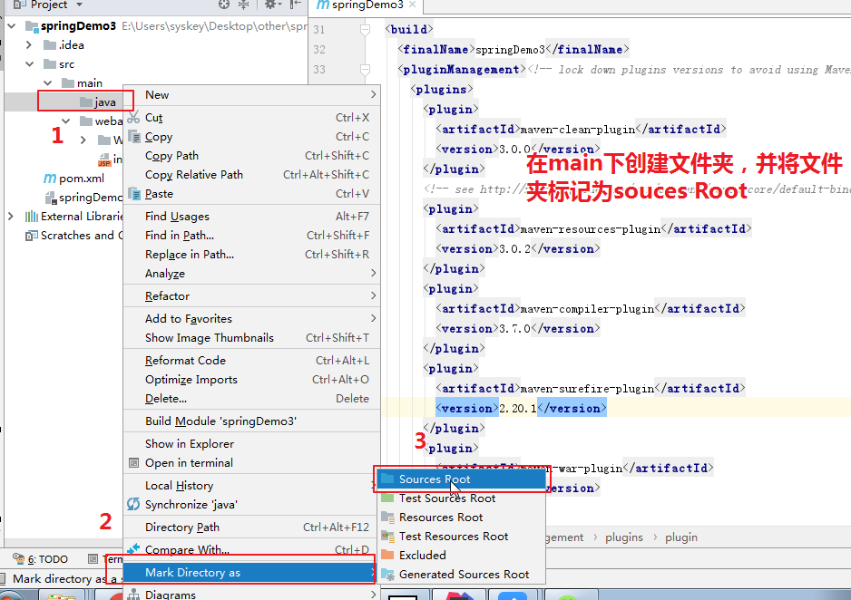

### 2、配置pom.xml

然后将如下内容copy到你的pom.xml文件中，这里就是maven最核心的内容，包括包引用，以及maven的插件：打包插件、编译插件等

```xml
<?xml version="1.0" encoding="UTF-8"?>
<project xmlns="http://maven.apache.org/POM/4.0.0" xmlns:xsi="http://www.w3.org/2001/XMLSchema-instance"
  xsi:schemaLocation="http://maven.apache.org/POM/4.0.0 http://maven.apache.org/xsd/maven-4.0.0.xsd">
  <modelVersion>4.0.0</modelVersion>

  <groupId>io.github.syske</groupId>
  <artifactId>springDemo</artifactId>
  <version>1.0-SNAPSHOT</version>
  <packaging>war</packaging>

  <name>springDemo Maven Webapp</name>
  <!-- FIXME change it to the project's website -->
  <url>http://www.example.com</url>

  <properties>
    <project.build.sourceEncoding>UTF-8</project.build.sourceEncoding>
    <maven.compiler.source>1.8</maven.compiler.source>
    <maven.compiler.target>1.8</maven.compiler.target>
    <spring.version>5.0.8.RELEASE</spring.version>
  </properties>

  <dependencies>
    <dependency>
      <groupId>junit</groupId>
      <artifactId>junit</artifactId>
      <version>4.11</version>
      <scope>test</scope>
    </dependency>

    <dependency>
      <groupId>org.springframework</groupId>
      <artifactId>spring-core</artifactId>
      <version>${spring.version}</version>
    </dependency>

    <!-- pring IOC的基础实现，包含访问配置文件、创建和管理bean等 -->
    <dependency>
      <groupId>org.springframework</groupId>
      <artifactId>spring-beans</artifactId>
      <version>${spring.version}</version>
    </dependency>

    <dependency>
      <groupId>org.springframework</groupId>
      <artifactId>spring-context</artifactId>
      <version>${spring.version}</version>
    </dependency>

    <dependency>
      <groupId>org.springframework</groupId>
      <artifactId>spring-context-support</artifactId>
      <version>${spring.version}</version>
    </dependency>

    <dependency>
      <groupId>org.springframework</groupId>
      <artifactId>spring-web</artifactId>
      <version>${spring.version}</version>
    </dependency>

    <dependency>
      <groupId>org.springframework</groupId>
      <artifactId>spring-webmvc</artifactId>
      <version>${spring.version}</version>
    </dependency>

    <dependency>
      <groupId>org.springframework</groupId>
      <artifactId>spring-tx</artifactId>
      <version>${spring.version}</version>
    </dependency>

    <dependency>
      <groupId>org.springframework</groupId>
      <artifactId>spring-aop</artifactId>
      <version>${spring.version}</version>
    </dependency>


    <dependency>
      <groupId>org.springframework</groupId>
      <artifactId>spring-aspects</artifactId>
      <version>${spring.version}</version>
    </dependency>

    <dependency>
      <groupId>org.springframework</groupId>
      <artifactId>spring-jdbc</artifactId>
      <version>${spring.version}</version>
    </dependency>

    <!-- https://mvnrepository.com/artifact/com.alibaba/fastjson -->
    <dependency>
      <groupId>com.alibaba</groupId>
      <artifactId>fastjson</artifactId>
      <version>1.2.49</version>
    </dependency>


    <dependency>
      <groupId>mysql</groupId>
      <artifactId>mysql-connector-java</artifactId>
    </dependency>
  </dependencies>

  <build>
    <finalName>springDemo</finalName>
    <pluginManagement><!-- lock down plugins versions to avoid using Maven defaults (may be moved to parent pom) -->
      <plugins>
        <plugin>
          <artifactId>maven-clean-plugin</artifactId>
          <version>3.0.0</version>
        </plugin>
        <!-- see http://maven.apache.org/ref/current/maven-core/default-bindings.html#Plugin_bindings_for_war_packaging -->
        <plugin>
          <artifactId>maven-resources-plugin</artifactId>
          <version>3.0.2</version>
        </plugin>
        <plugin>
          <artifactId>maven-compiler-plugin</artifactId>
          <version>3.7.0</version>
        </plugin>
        <plugin>
          <artifactId>maven-surefire-plugin</artifactId>
          <version>2.20.1</version>
        </plugin>
        <plugin>
          <artifactId>maven-war-plugin</artifactId>
          <version>3.2.0</version>
        </plugin>
        <plugin>
          <artifactId>maven-install-plugin</artifactId>
          <version>2.5.2</version>
        </plugin>
        <plugin>
          <artifactId>maven-deploy-plugin</artifactId>
          <version>2.8.2</version>
        </plugin>
      </plugins>
    </pluginManagement>
  </build>
</project>
```

### 3、配置web.xml

这个没什么好说的，所有web项目最核心的文件，项目的入口，需要在这里配置spring容器

```xml
<?xml version="1.0" encoding="UTF-8"?>
<web-app xmlns:xsi="http://www.w3.org/2001/XMLSchema-instance" xmlns="http://java.sun.com/xml/ns/javaee" xsi:schemaLocation="http://java.sun.com/xml/ns/javaee http://java.sun.com/xml/ns/javaee/web-app_3_0.xsd" id="WebApp_ID" version="3.0">
  <display-name>springMVC</display-name>
  <welcome-file-list>
    <welcome-file>index.html</welcome-file>
    <welcome-file>index.htm</welcome-file>
    <welcome-file>index.jsp</welcome-file>
    <welcome-file>default.html</welcome-file>
    <welcome-file>default.htm</welcome-file>
    <welcome-file>default.jsp</welcome-file>
  </welcome-file-list>
  <!-- 过滤器 -->
  <listener>
    <listener-class>org.springframework.web.context.ContextLoaderListener</listener-class>
  </listener>

  <context-param>
    <param-name>contextConfigLocation</param-name>
    <param-value>classpath:spring-dispatcher-servlet.xml</param-value>
  </context-param>
  <!-- DispatcherServlet配置-->
  <servlet>
    <servlet-name>springServlet</servlet-name>
    <servlet-class>org.springframework.web.servlet.DispatcherServlet</servlet-class>

    <init-param>
      <param-name>contextConfigLocation</param-name>
      <param-value></param-value>
    </init-param>

    <load-on-startup>1</load-on-startup>
  </servlet>

  <servlet-mapping>
    <servlet-name>springServlet</servlet-name>
    <url-pattern>/</url-pattern>
  </servlet-mapping>
</web-app>
```

### 4、spring核心配置spring-dispatcher-servlet.xml

这个文件有在web.xml中引用，请注意本文件的存放路径，本实例的存放路径是src/main/resources，编译后会进入classpath。

本文件用于设置所有的spring框架相关的配置，包括事务、页面引擎模板、bean

```xml
<?xml version="1.0" encoding="UTF-8"?>
<beans xmlns="http://www.springframework.org/schema/beans"
       xmlns:xsi="http://www.w3.org/2001/XMLSchema-instance"
       xmlns:context="http://www.springframework.org/schema/context"
       xmlns:mvc="http://www.springframework.org/schema/mvc"
       xsi:schemaLocation="http://www.springframework.org/schema/beans http://www.springframework.org/schema/beans/spring-beans.xsd
        http://www.springframework.org/schema/context http://www.springframework.org/schema/context/spring-context-4.1.xsd
        http://www.springframework.org/schema/mvc http://www.springframework.org/schema/mvc/spring-mvc-4.1.xsd">

    <!-- scan the package and the sub package -->
    <context:component-scan base-package="io.github.syske"/>

    <!-- don't handle the static resource -->
    <mvc:default-servlet-handler />

    <!-- if you use annotation you must configure following setting -->
    <mvc:annotation-driven />

    <!-- configure the InternalResourceViewResolver -->
    <bean class="org.springframework.web.servlet.view.InternalResourceViewResolver"
          id="internalResourceViewResolver">
        <!-- 前缀 -->
        <property name="prefix" value="/WEB-INF/view/" />
        <!-- 后缀 -->
        <property name="suffix" value=".jsp" />
    </bean>
</beans>
```

### 5、项目结构

下面是本项目创建完成后的结构，需要注意的是配置文件的存放路径

- 这里要格外注意spring核心配置的路径，上面我说到存放到resources文件夹，如果没有创建这个文件夹，存放到src底下也是一样的，考虑到后续项目拓展，涉及到的配置文件比较多，建议大家还是创建resources文件夹
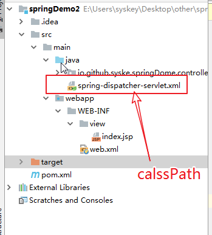

### 6、项目部署
- 这里部署的环境是tomcat，如果本地还没有tomcat或者插件没启用，要先把本地服务器配置好，不然你可能找不到tomcat这个选项

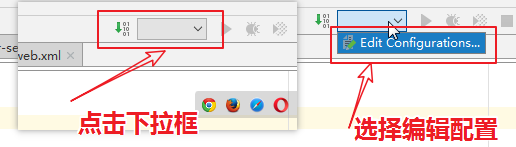

- 添加新的配置，选择tomcat，因为我是本地的所以选local，如果你是远程的tomcat，就选下面的remote，前提是你已经配置过了

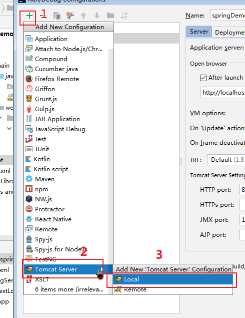

- 配置tomcat服务器的基本信息，这里配置的和你项目相关的

  - 第三步这里设置的是项目访问路径，如果你不知道项目名，那项目的访问路径就是localhost:8080/

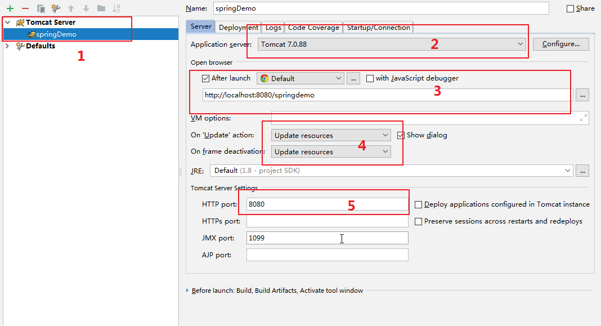

- 部署项目

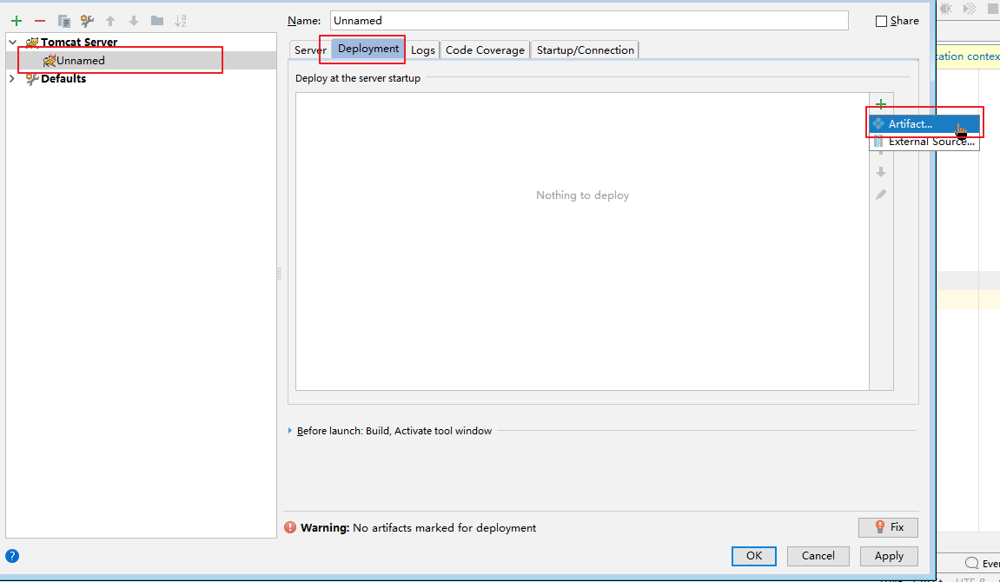

- 选择部署形式
  - 如果部署这里没有下面的选项，在项目结构（快捷键CTRL + alt + shift + s）下Artifacts配置，具体的可以查询相关资料，不清楚的可以留言

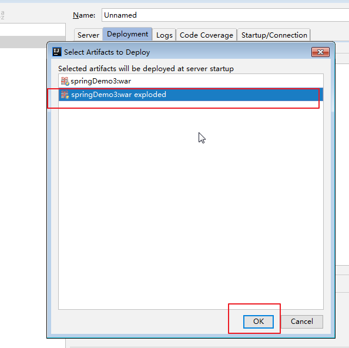

- 运行

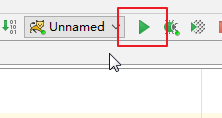

以上步骤完成了，整个项目就已经创建完成，是不是感觉很简单，赶快动手自己做一下吧，好记性不如烂笔头，动手行动起来，不要你觉得，我要我觉得……