# IReport实践指南

#### 前言

最近，在做一个电子签章的功能，然后就接触到IReport报表，经过好几天的摸索实践，功能已经完成了，今天来总结一下。

什么是IReport，IReport是JasperReports报表的可视化设计器，准确地说，本文的名字应该叫JasperReports实践指南，好了废话不多说了，直接开始今天的内容吧。

#### 报表设计

##### 下载设计器

下载报表设计器，网址如下：

```http
https://community.jaspersoft.com/project/ireport-designer/releases
```

然后选择下面的选项，然后点击下载：

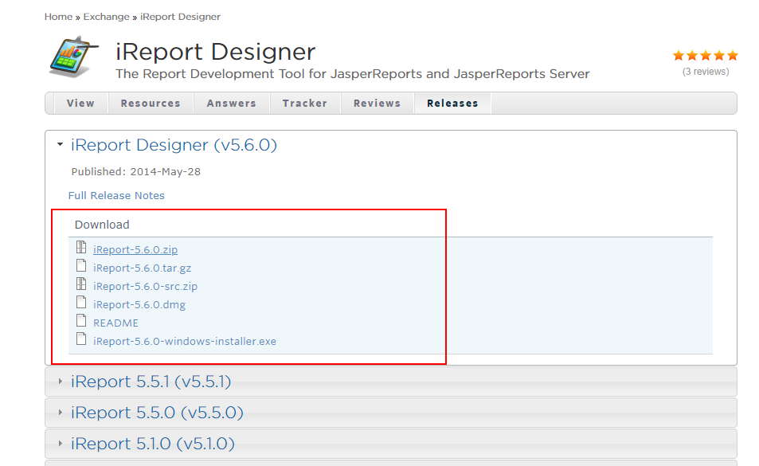

然后解压，进入bin文件夹，打开ireport.exe，界面如下：

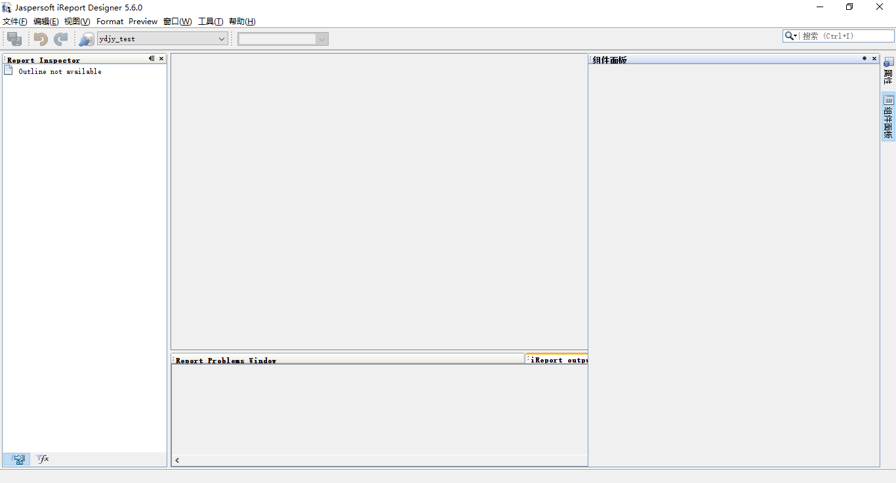

##### 选择报表模板，创建报表

然后新建一个报表，根据自己的需求选择合适的尺寸，然后点击Launch Report Wizard，选择保存路径，设置名称，然后下一步

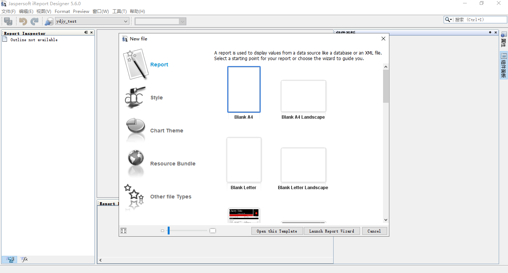

##### 设置报表名称及存储路径

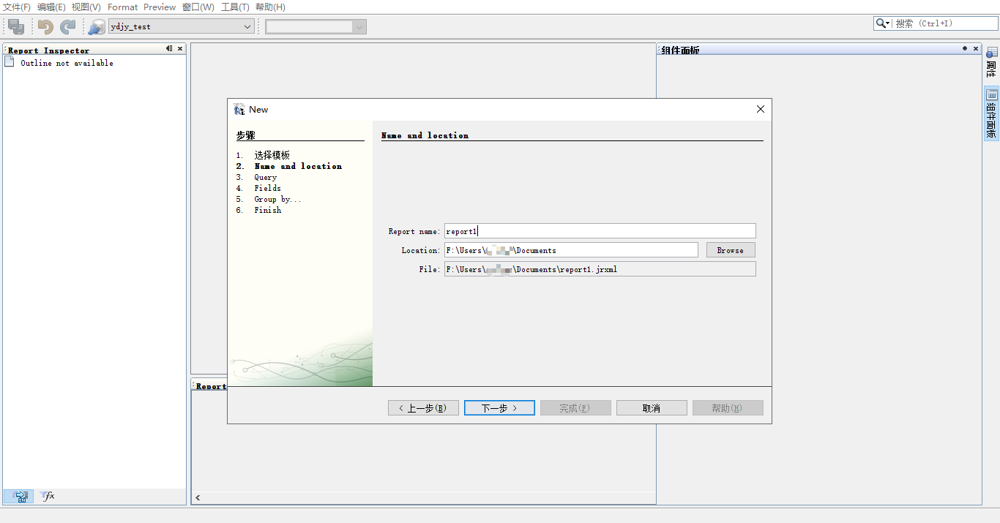

##### 设置数据源

然后设置数据源，如果是第一次打开，那你需要创建自己的数据源，点击New开始


选择数据源,我这里选择的是jdbc connection，其他的没有研究，用兴趣的小伙伴可以研究下

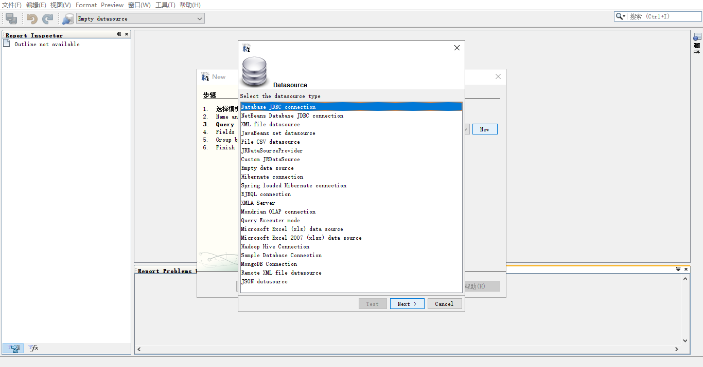

设置数据源，包括地址、驱动类型，用户名、密码，配置完成后点击test测试下你的数据源，如果报错，可能是你还没有添加数据库驱动jar包：

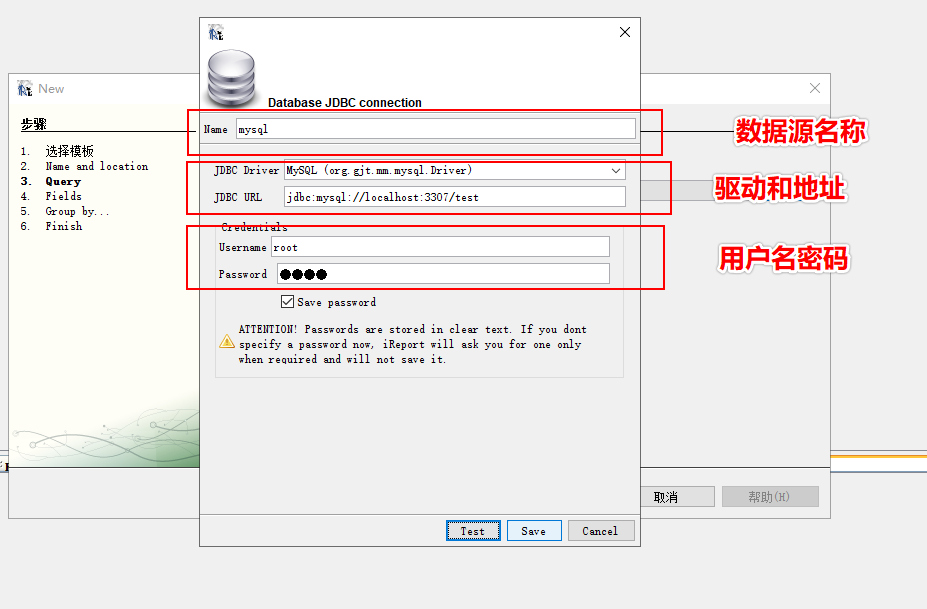

当然，如果你添加的数据库驱动是红的的，也说明你还没有添加驱动的jar包：

在工具 -> 选项菜单下，找到classpath

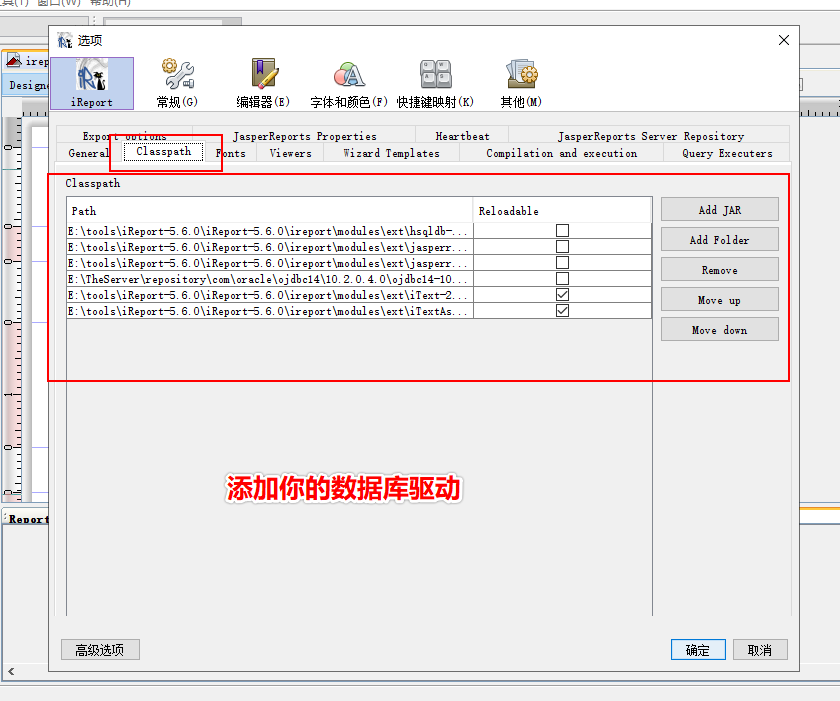

##### 配置核心数据集

配置报表主数据集

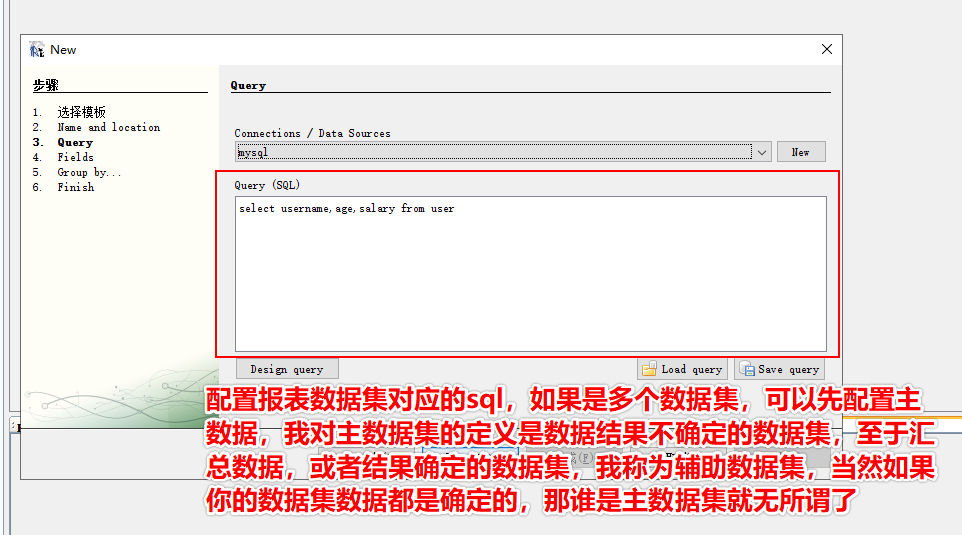

##### 配置字段

配置需要显示的字段

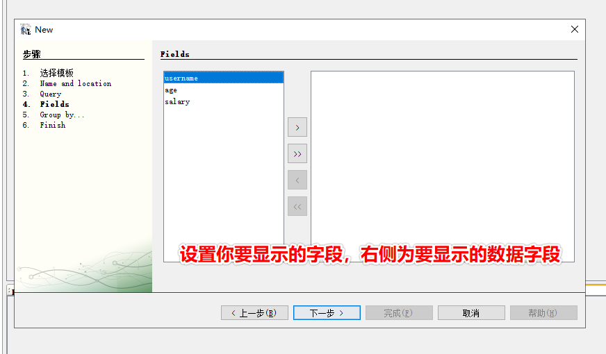

然后，下一步，完成，报表就创建完成了，接着我们该开始报表设计了。

#### 设计报表

##### 设计器

设计器主要分为四个区域：

- 当前报表元素：包括数据集、已添加控件、变量、字段
- 页面设计区：我们需要将控件拖入该区域，包括设计视图、xml视图和预览视图
- 组件面板：包括各种常用的控件，如静态文本、字段文本、形状、图表等
- 控制台：显示报表编译信息、错误警告

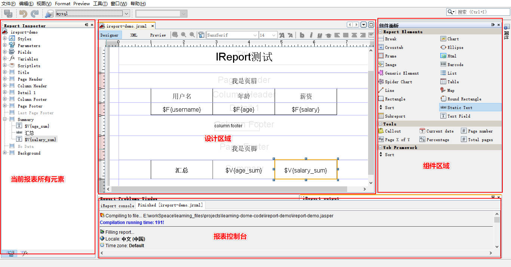

##### 基本控件

常用的基本控件：

**rectangle：**矩形，如果是简单表格的话可以用他

**Static Text：**顾名思义，静态文本，比如我们的表头，标题等

**Text Field：**字段文本用于显示我们的动态数据，也就是数据库查出来的数据

**List：**如果你的报表涉及多个数据集，List是个很有用的工具，反正我是通过它来实现的

其他的我还没研究，目前已经可以满足我的需求了

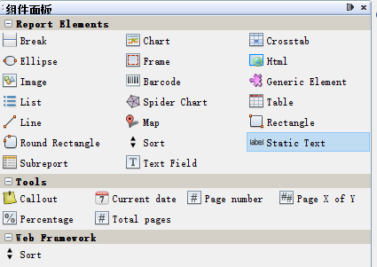

##### 报表页面结构

报表基本结构如下：

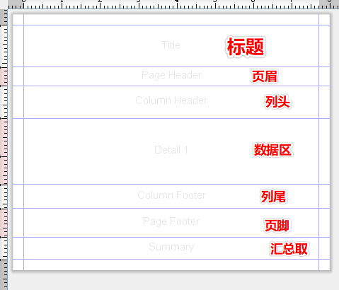

这里解释下各个区域的含义和功能：

**标题：**整个文档只显示一次，相当于表名称，只在第一页显示

**页眉：**这个大家应该很熟悉，用过word的都清楚，该区域的内容每页都会显示

**列头：**相当于表头，但该区域的内容每一页都会显示

**数据区：**这里就是数据显示的核心区，该区域内容会自动循环显示，就相当于表格的body

**列尾：**和列头类似，每页都会有

**页脚：**同页眉，不再赘述

**汇总区：**我发现截图写错字了😂，不改了，这里主要显示的是汇总数据，比如各列的汇总小计

下面是我输出的报表，大家可以参考下

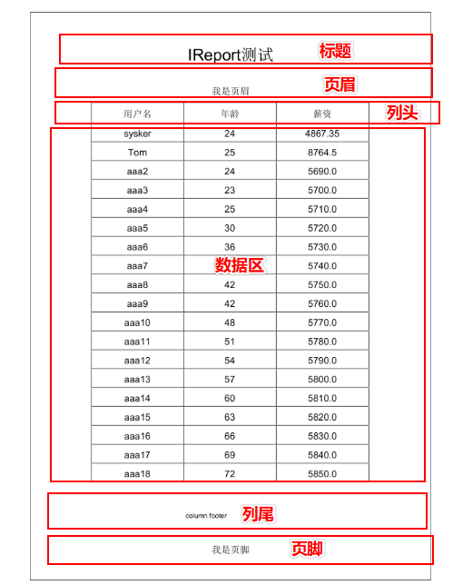

汇总区在最后一页显示

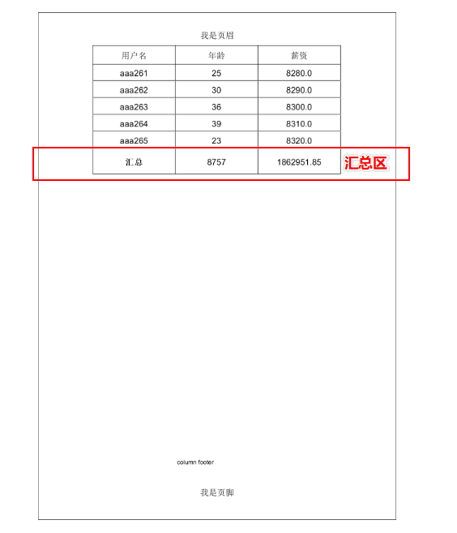

##### 设计报表

下来，开始设计我们的第一个报表。这里演示的是单个数据集的情况，刚才新建报表的时候已经添加过数据集了，所以我就不再创建。具体编辑方式如下：

##### 编辑核心数据集

选中报表，右键Edit Query

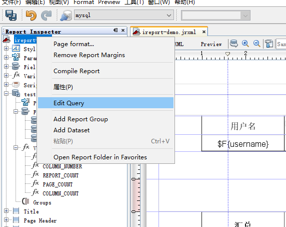

然后配置数据sql，字段会自动识别，入参是sql入参，先不用考虑如何传入参，只用配置sql即可


##### 插入控件

拖入需要的控件：

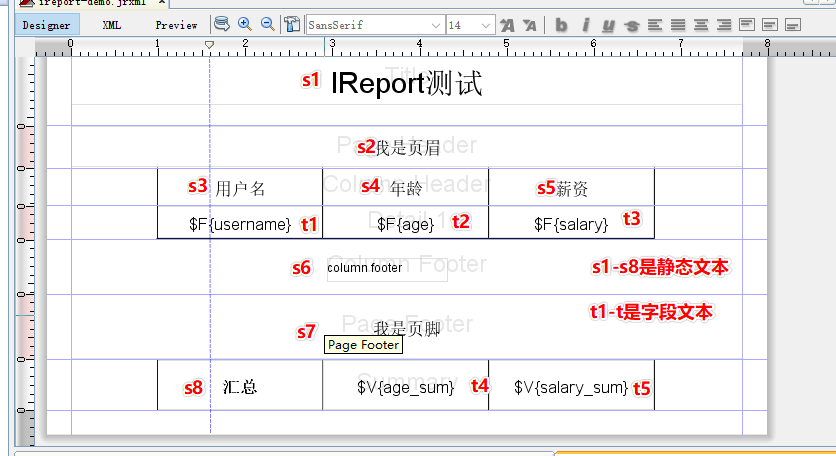

选中控件，点击属性面板，可以编辑控件数据，包括字体大小，格式等数据，双击控件可以编辑控件内容

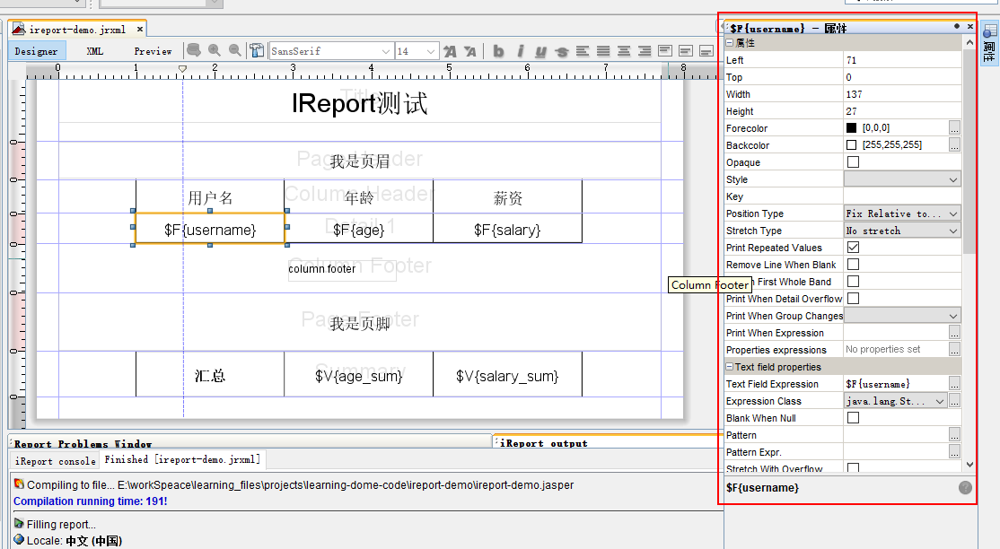

对于Text Field控件，**$F{字段名}**表示显示字段数据，​**$V{变量名}**表示显示变量数据，**$P{参数名}**表示显示参数数据。当然也可以直接在你自己报表下方对应的区域直接拖到设计区。

对于中文内容，必须设定如下两个属性，否则pdf输出的时候是没有内容的。

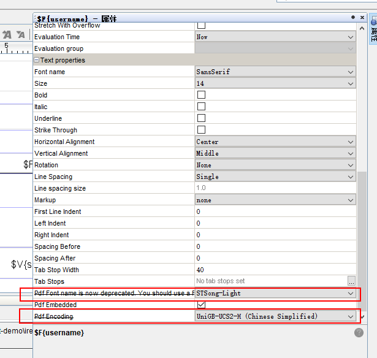


##### sql传参

首先在Parameters下面创建我们的入参参数，如果你是多个数据集，你的入参一定要创建在对应的数据集下面。

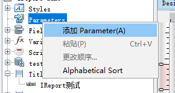

然后编辑数据集，如果是默认的数据集，直接Edit Query：

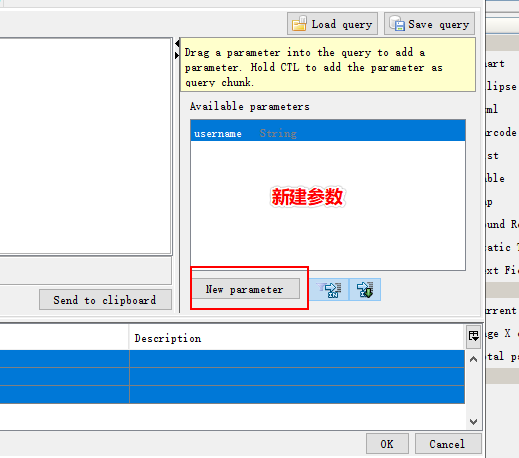

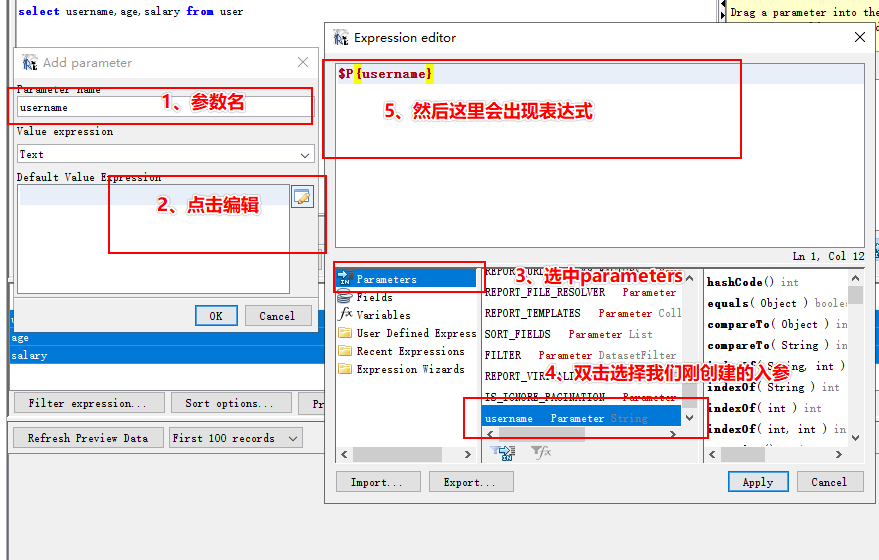

当然也要改下我们的sql：

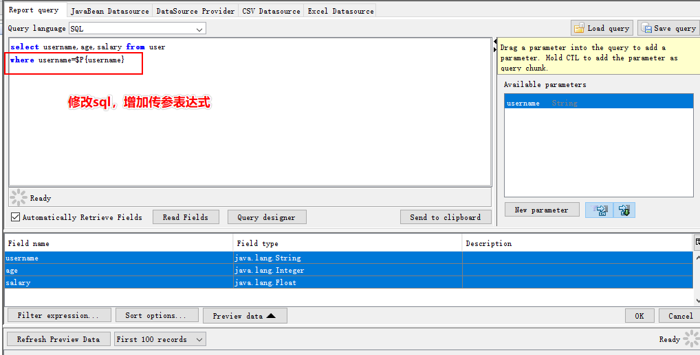

然后点击预览，输入参数


如果没有什么问题的话，可以看到类似如下内容：

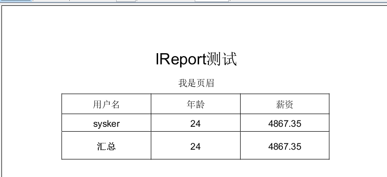

到这里我们第一个报表就算完结了。如果有问题，好好看下以上内容。

#### 多数据集

如果你的报表涉及到多个sql，那你就需要创建多个数据集。具体创建数据集方式如下：

选中报表，右键Add Datasets

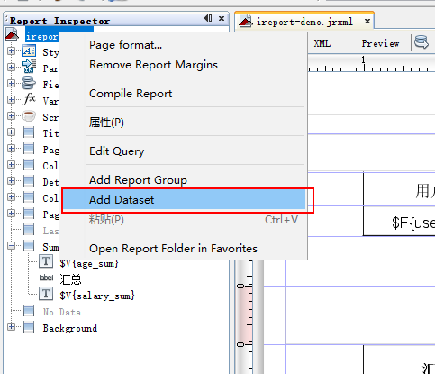

配置sql，如果还没配数据源，先配置数据源，忘记了如何配置可以返回前面看下

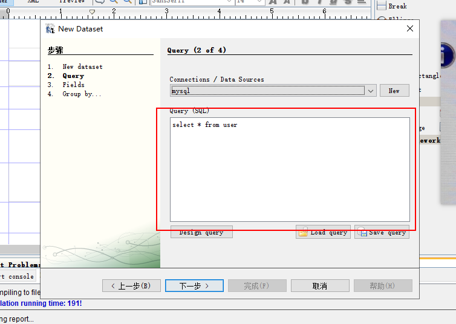

选择数据字段

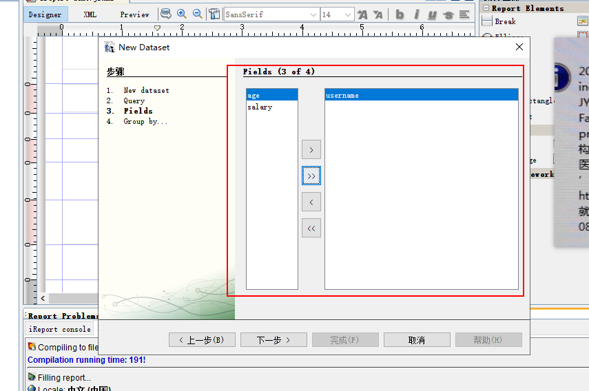

选择数据分组，没有分组可以不选，然后直接完成

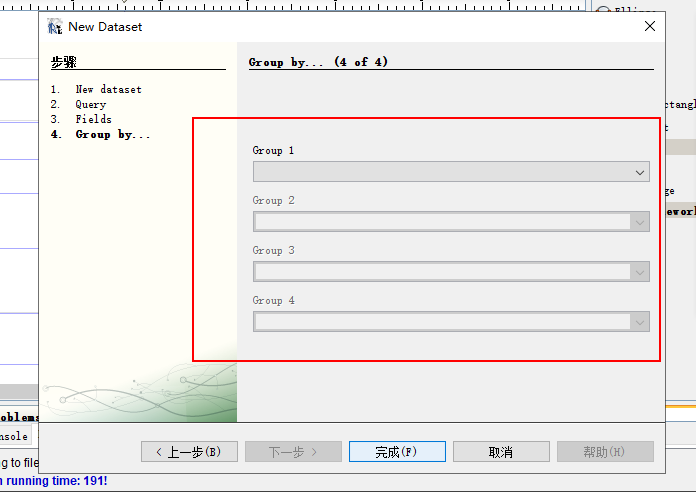

##### 插入List控件

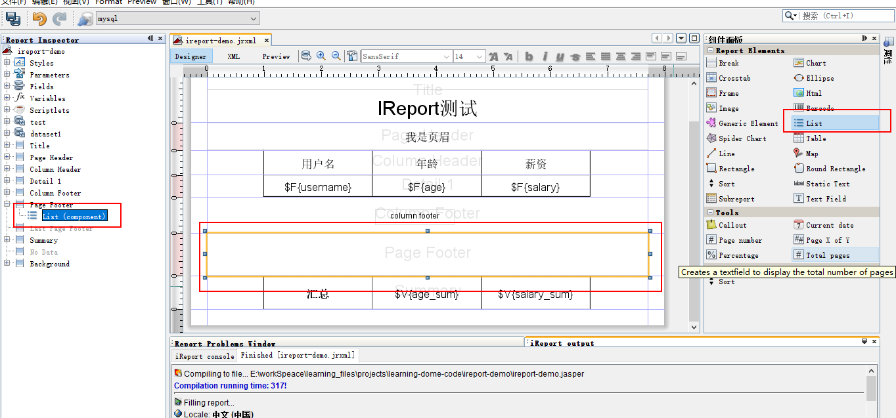

编辑List数据集，选择数据集，设置连接表达式

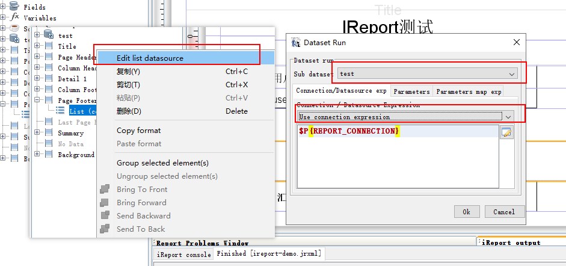

##### 在List下创建我们的控件

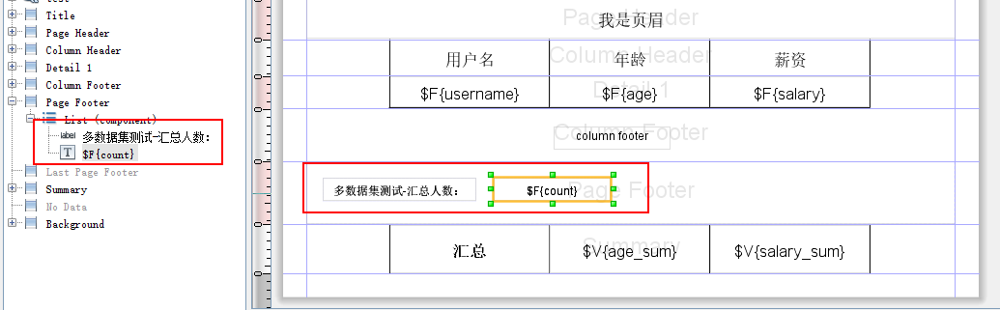

然后预览，你会发现两个数据集都执行了，效果如下：

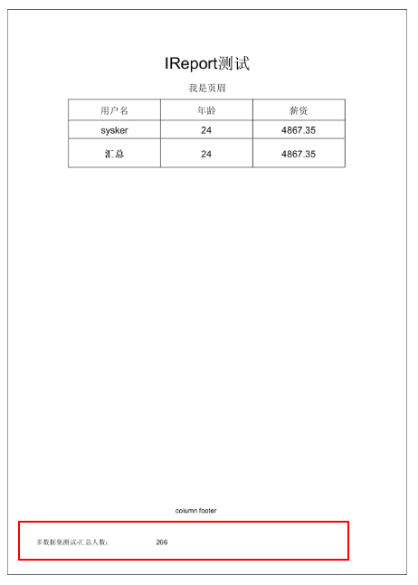

好了，今天就到这里吧！本周周末会接着本周的内容，来介绍如何在web项目容使用我们今天绘制的报表。