**41、返回值的函数**

**思考:**上一节函数中，通过"`document.write`"把结果输出来，如果想对函数的结果进行处理怎么办呢？

我们只要把"`document.write(sum)`"这行改成如下代码：

```js
function add2(x,y) {    
	sum = x + y;    
	return sum; //返回函数值,return后面的值叫做返回值。
}
```

还可以通过变量存储调用函数的返回值，代码如下:

```js
result = add2(3,4);//语句执行后,result变量中的值为7。
```

**注意:函数中参数和返回值不只是数字，还可以是字符串等其它类型。**

 

**42、什么是事件**

JavaScript 创建动态页面。事件是可以被 JavaScript 侦测到的行为。 网页中的每个元素都可以产生某些可以触发 JavaScript 函数或程序的事件。

比如说，当用户单击按钮或者提交表单数据时，就发生一个鼠标单击（onclick）事件，需要浏览器做出处理，返回给用户一个结果。

**主要事件表:** 

|    事件     |         说明         |
| :---------: | :------------------: |
|   onclick   |     鼠标单击事件     |
| onmouseover |     鼠标经过事件     |
| onmouseout  |     鼠标移开事件     |
|  onchange   |  文本框内容改变事件  |
|  onselect   | 文本框内容被选中事件 |
|   onfocus   |       光标聚焦       |
|   onblur    |       光标离开       |
|   onload    |       网页导入       |
|   onload    |       关闭网页       |

**43、鼠标单击事件( onclick ）**

onclick是鼠标单击事件，当在网页上单击鼠标时，就会发生该事件。同时onclick事件调用的程序块就会被执行，通常与按钮一起使用。

比如，我们单击按钮时，触发 onclick 事件，并调用两个数和的函数add2()。代码如下：

```js
<html>

<head>   

    <script type="text/javascript">  
     function add2(){   
     var numa,numb,sum;
     numa=6;         
     numb=8;         
     sum=numa+numb;       

     document.write("两数和为:"+sum);  
     }  

     </script>

</head>

<body>   

    <form>      

    	<input name="button" type="button" value="点击提交" onclick="add2()" />   

    </form>

</body>

</html>
```

**注意:** 在网页中，如使用事件，就在该元素中设置事件属性。 

 

**44、鼠标经过事件（onmouseover）**

鼠标经过事件，当鼠标移到一个对象上时，该对象就触发onmouseover事件，并执行onmouseover事件调用的程序。

现实鼠标经过"确定"按钮时，触发onmouseover事件，调用函数info()，弹出消息框，代码如下:

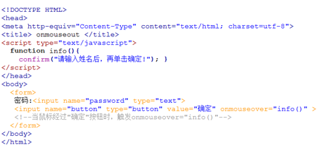

**运行结果:**

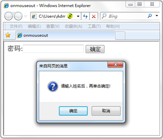

 

**45、鼠标移开事件（onmouseout）**

鼠标移开事件，当鼠标移开当前对象时，执行onmouseout调用的程序。

当把鼠标移动到"登录"按钮上，然后再移开时，触发onmouseout事件，调用函数message()，代码如下:

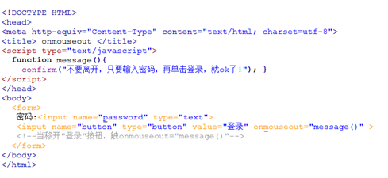

**运行结果:**

 

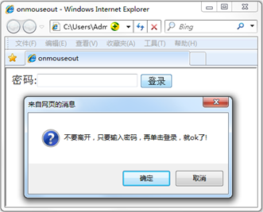

 

**46、光标聚焦事件（onfocus）**

当网页中的对象获得聚点时，执行onfocus调用的程序就会被执行。

如下代码, 当将光标移到文本框内时，即焦点在文本框内，触发onfocus 事件，并调用函数message()。

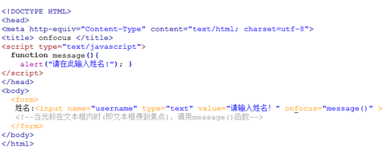

**运行结果：**


 

**47、失焦事件（onblur）**

onblur事件与onfocus是相对事件，当光标离开当前获得聚焦对象的时候，触发onblur事件，同时执行被调用的程序。

如下代码, 网页中有用户和密码两个文本框。当前光标在用户文本框内时（即焦点在文本框），在光标离开该文本框后（即失焦时），触发onblur事件，并调用函数message()。

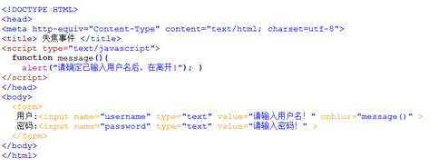

**运行结果：**

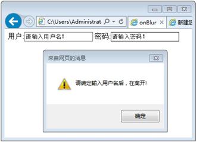

 

**48、内容选中事件（onselect）**

选中事件，当文本框或者文本域中的文字被选中时，触发onselect事件，同时调用的程序就会被执行。

如下代码,当选中用户文本框内的文字时，触发onselect 事件，并调用函数message()。

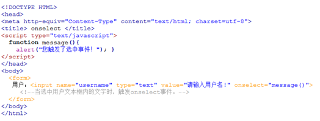

**运行结果：**

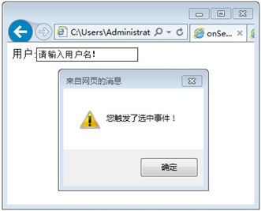

 

**49、文本框内容改变事件（onchange）**

通过改变文本框的内容来触发onchange事件，同时执行被调用的程序。

如下代码,当用户将文本框内的文字改变后，弹出对话框“您改变了文本内容！”。

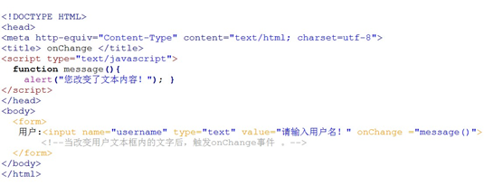

**运行结果：**

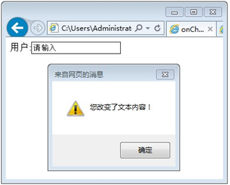

 

**50、加载事件（onload）**

事件会在页面加载完成后，立即发生，同时执行被调用的程序。

**注意：**

- 1. 加载页面时，触发onload事件，事件写在`<body>`标签内。

- ​    2. 此节的加载页面，可理解为打开一个新页面时。


如下代码,当加载一个新页面时，弹出对话框“加载中，请稍等…”。

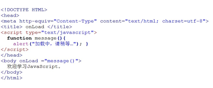

**运行结果：**

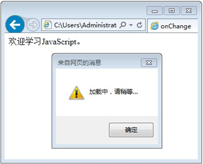

 

**51、卸载事件（onunload）**

当用户退出页面时（页面关闭、页面刷新等），触发onUnload事件，同时执行被调用的程序。

**注意：不同浏览器对onunload事件支持不同。**

如下代码,当退出页面时，弹出对话框“您确定离开该网页吗？”。

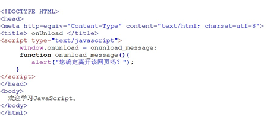

**运行结果：（IE浏览器）**

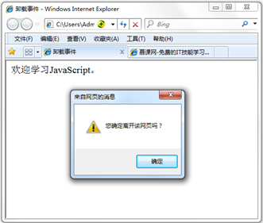

 

**52、什么是对象**

JavaScript 中的所有事物都是对象，如:字符串、数值、数组、函数等，每个对象带有**属性**和**方法**。

**对象的属性：**反映该对象某些特定的性质的，如：字符串的长度、图像的长宽等；

**对象的方法：**能够在对象上执行的动作。例如，表单的“提交”(Submit)，时间的“获取”(getYear)等；

JavaScript 提供多个内建对象，比如 String、Date、Array 等等，使用对象前先定义，如下使用数组对象：

```js
var objectName =new Array();//使用new关键字定义对象或者var objectName =[];
```

**访问对象属性的语法:**

```
objectName.propertyName
```

如使用 Array 对象的 length 属性来获得数组的长度：

```js
var myarray=new Array(6);//定义数组对象var myl=myarray.length;//访问数组长度length属性
```

**以上代码执行后，myl的值将是：6**

**访问对象的方法：**

```
objectName.methodName()
```

如使用string 对象的 toUpperCase() 方法来将文本转换为大写：

```js
var mystr="Hello world!";//创建一个字符串

var request=mystr.toUpperCase(); //使用字符串对象方法
```

以上代码执行后，request的值是**：`HELLO WORLD!`**

 

**53、Date 日期对象**

日期对象可以储存任意一个日期，并且可以精确到毫秒数（1/1000 秒）。

定义一个时间对象 :

```js
var Udate=new Date();
```

**注意:**使用关键字new，Date()的首字母必须大写。 

使 Udate 成为日期对象，并且已有初始值：**当前时间(当前电脑系统时间)**。

如果要自定义初始值，可以用以下方法：

```js
var d = new Date(2012, 10, 1);  //2012年10月1日 var d = new Date('Oct 1, 2012'); //2012年10月1日
```

我们最好使用下面介绍的“方法”来严格定义时间。

**访问方法语法：**“<日期对象>.<方法>”

Date对象中处理时间和日期的常用方法：

| 方法名称          | 功能描述                                     |
| ----------------- | -------------------------------------------- |
| get/setDate()     | 返回/设置日期                                |
| get/setFullYear() | 返回/设置年份，用四位数表示                  |
| get/setYear()     | 返回/设置年份                                |
| get/setMonth()    | 返回/设置月份，0：一月……11：十二月，所以加一 |
| get/setHours()    | 返回/设置小时，24小时制                      |
| get/setMinutes()  | 返回/设置分钟数                              |
| get/setSeconds()  | 返回/设置秒钟数                              |
| get/setTime()     | 返回/设置时间（毫秒为单位）                  |

**54、返回/设置年份方法**

`get/setFullYear()` 返回/设置年份，用四位数表示。

```js
var mydate=new Date();//当前时间2014年3月6日
document.write(mydate+"<br>");//输出当前时间
document.write(mydate.getFullYear()+"<br>");//输出当前年份 
mydate.setFullYear(81); //设置年份
document.write(mydate+"<br>"); //输出年份被设定为 0081年。
```

**注意:**不同浏览器， mydate.setFullYear(81)结果不同，年份被设定为 0081或81两种情况。

**结果:**

```
Thu Mar 06 2014 10:57:47 GMT+0800 2014 Thu Mar 06 0081 10:57:47 GMT+0800
```

**注意:**

- 1.结果格式依次为：星期、月、日、年、时、分、秒、时区。(火狐浏览器)

- 2.不同浏览器，时间格式有差异。

 

**55、返回星期方法**

**`getDay()`** 返回星期，返回的是0-6的数字，0 表示星期天。如果要返回相对应“星期”，通过数组完成，代码如下:

```js
<script type="text/javascript">

​       var mydate=new Date();//定义日期对象

var weekday=["星期日","星期一","星期二","星期三","星期四","星期五","星期六"];//定义数组对象,给每个数组项赋值

var mynum=mydate.getDay();//返回值存储在变量mynum中  
document.write(mydate.getDay());//输出getDay()获取值

document.write("今天是："+ weekday[mynum]);//输出星期几

</script>
```

注意：以上代码是在2014年3月7日，星期五运行。

**结果:**

```
5

今天是：星期五
```

 

**56、返回/设置时间方法**

**`get/setTime()`** 返回/设置时间，单位毫秒数，计算从 1970 年 1 月 1 日零时到日期对象所指的日期的毫秒数。

如果将目前日期对象的时间推迟1小时，代码如下:

```js
<script type="text/javascript"> 

 var mydate=new Date();  

document.write("当前时间："+mydate+"<br>");   
mydate.setTime(mydate.getTime() + 60 * 60 * 1000);  

document.write("推迟一小时时间：" + mydate);

</script>
```

**结果:**

```
当前时间：Thu Mar 6 11:46:27 UTC+0800 2014

推迟一小时时间：Thu Mar 6 12:46:27 UTC+0800 2014
```

**注意:**

- 1. 一小时 60 分，一分 60 秒，一秒 1000 毫秒

- 2. 时间推迟 1 小时,就是: “`x.setTime(x.getTime() + 60 * 60 * 1000);`”

 

**57、String 字符串对象**

在之前的学习中已经使用字符串对象了，定义字符串的方法就是直接赋值。比如：

```js
var mystr = "I love JavaScript!"
```

定义mystr字符串后，我们就可以访问它的属性和方法。

**访问字符串对象的属性length:**

stringObject.length; 返回该字符串的长度。

```js
var mystr="Hello World!"; 
var myl=mystr.length;
```

以上代码执行后，myl 的值将是：12

**访问字符串对象的方法：**

使用 String 对象的 toUpperCase() 方法来将字符串小写字母转换为大写：

```js
var mystr="Hello world!";

var mynum=mystr.toUpperCase();
```

以上代码执行后，mynum 的值是：HELLO WORLD!

 

**58、返回指定位置的字符**

`charAt()` 方法可返回指定位置的字符。返回的字符是长度为 1 的字符串。

**语法:**

```
stringObject.charAt(index)
```

- **参数说明：**

| 参数  | 描述                                                     |
| ----- | -------------------------------------------------------- |
| index | 必需。表示字符串中某个位置的数字，即字符在字符串中的下标 |

- **注意：**

1.字符串中第一个字符的下标是 0。最后一个字符的下标为字符串长度减一（string.length-1）。

2.如果参数 index 不在 0 与 string.length-1 之间，该方法将返回一个空字符串。

**如:**在字符串 "I love JavaScript!" 中，返回位置2的字符：

```js
<script type="text/javascript">  

var mystr="I love JavaScript!" ；

document.write(mystr.charAt(2));

</script>
```

**注意：**一个空格也算一个字符。

以上代码的运行结果：

```
l
```

 

**59、返回指定的字符串首次出现的位置**

`indexOf()` 方法可返回某个指定的字符串值在字符串中首次出现的位置。

**语法**

```
stringObject.indexOf(substring, startpos)
```

**参数说明：**

| 参数      | 描述                                                         |
| --------- | ------------------------------------------------------------ |
| substring | 必须。规定需检索的字符串                                     |
| startpos  | 可选的整数参数。规定在字符串中开始检索的位置。它的合法取值是0到stringObject.length-1。如省略该参数，则将从字符串的首字符开始检索。 |

**说明：**

- 1.该方法将从头到尾地检索字符串 stringObject，看它是否含有子串 substring。

- 2.可选参数，从stringObject的startpos位置开始查找substring，如果没有此参数将从stringObject的开始位置查找。

- 3.如果找到一个 substring，则返回 substring 的第一次出现的位置。stringObject 中的字符位置是从 0 开始的。

**注意：**

- 1.`indexOf()` 方法区分大小写。

- 2.如果要检索的字符串值没有出现，则该方法返回 -1。

例如: 对 "I love JavaScript!" 字符串内进行不同的检索：

```js
<script type="text/javascript">  

var str="I love JavaScript!"  

document.write(str.indexOf("I") + "<br />");  

document.write(str.indexOf("v") + "<br />"); 

 document.write(str.indexOf("v",8));

</script>
```

以上代码的输出：

```
0 4 9
```

 

**60、字符串分割split()**

**知识讲解：**

`split()` 方法将字符串分割为字符串数组，并返回此数组。

**语法：**

```
stringObject.split(separator,limit)
```

**参数说明:**

| 参数      | 描述                                                         |
| --------- | ------------------------------------------------------------ |
| separator | 必须。从该参数指定的底方分割stringObject                     |
| limit     | 可选参数，分割的次数，如设置该参数，返回的子串不会多于这个参数指定的数组，如果无此参数为不限制次数 |

**注意：**如果把空字符串 ("") 用作 separator，那么 stringObject 中的每个字符之间都会被分割。

**我们将按照不同的方式来分割字符串：**

使用指定符号分割字符串，代码如下:

```js
var mystr = "www.imooc.com";

document.write(mystr.split(".")+"<br>");

document.write(mystr.split(".", 2)+"<br>");
```

**运行结果:**

```
www,imooc,com www,imooc
```

将字符串分割为字符，代码如下：

```
document.write(mystr.split("")+"<br>");

document.write(mystr.split("", 5));
```

运行结果:

```
w,w,w,.,i,m,o,o,c,.,c,o,m w,w,w,.,i
```

[^1]: 参考内容：慕课网|菜鸟教程
[^2]: 部分内容来源网络，侵删

