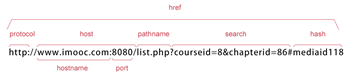
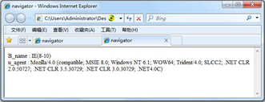
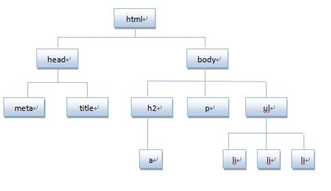
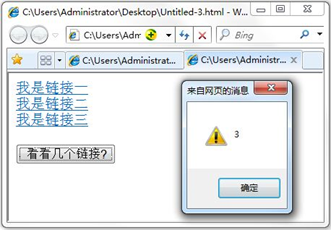
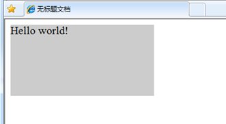
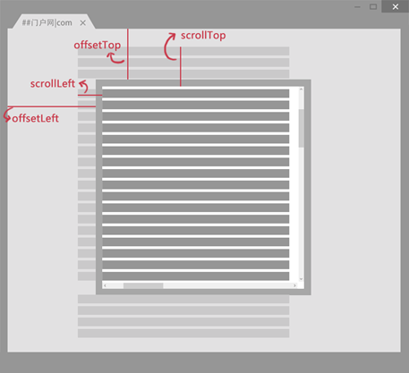

#### **81、返回前一个浏览的页面**

back()方法，加载 history 列表中的前一个 URL。

**语法：**

```
window.history.back();
```

比如，返回前一个浏览的页面，**代码如下：**

```
window.history.back();
```

**注意：等同于点击浏览器的倒退按钮。**

back()相当于go(-1),**代码如下:**

```
window.history.go(-1);
```

 

#### **82、返回下一个浏览的页面**

forward()方法，加载 history 列表中的下一个 URL。

如果倒退之后，再想回到倒退之前浏览的页面，则可以使用forward()方法,**代码如下:**

```
window.history.forward();
```

**注意：等价点击前进按钮。**

forward()相当于go(1),**代码如下:**

```
window.history.go(1);
```

 

#### **83、返回浏览历史中的其他页面**

go()方法，根据当前所处的页面，加载 history 列表中的某个具体的页面。

**语法：**

```
window.history.go(number);
```

**参数：**

| number   | 参数说明                                  |
| -------- | ----------------------------------------- |
| 1        | 前一个，go(1)等价forward()                |
| 0        | 当前页面                                  |
| -1       | 后一个，go(-1)等价back()                  |
| 其他参数 | 要访问的URL在History的URL列表中的相对位置 |

浏览器中，返回当前页面之前浏览过的第二个历史页面，**代码如下：**

```
window.history.go(-2);
```

**注意：和在浏览器中单击两次后退按钮操作一样。**

同理，返回当前页面之后浏览过的第三个历史页面，**代码如下：**

```
window.history.go(3);
```

 

#### 84、Location对象

location用于获取或设置窗体的URL，并且可以用于解析URL。

**语法:**

```
location.[属性|方法]
```

**location对象属性图示:**



**location 对象属性：**

| 属性     | 描述                                       |
| -------- | ------------------------------------------ |
| hash     | 设置或返回从井号（#）开始的URL(锚)         |
| host     | 设置或返回主机名和当前URL的端口号          |
| hostname | 设置或返回当前URL的主机名                  |
| href     | 设置或返回完整的URL                        |
| pathname | 设置或返回当前URL的路径部分                |
| port     | 设置或返回当前URL的端口号                  |
| protocol | 设置或返回当前URL的协议                    |
| search   | 设置或返回从问号（?）开始的URL（查询部分） |

**location 对象方法:**

| 属性      | 描述                   |
| --------- | ---------------------- |
| assign()  | 加载新的文档           |
| reload()  | 重新加载当前文档       |
| replace() | 用新的文档替换当前文档 |

#### **85、Navigator对象**

Navigator 对象包含有关浏览器的信息，通常用于检测浏览器与操作系统的版本。

**对象属性:**

| 属性        | 描述                                       |
| ----------- | ------------------------------------------ |
| appCodeName | 浏览器代码名的字符串标识                   |
| appName     | 返回浏览器的名称                           |
| appVersion  | 返回浏览器的平台和版本信息                 |
| platform    | 返回运行浏览器的操作系统平台               |
| userAgent   | 返回由客户机发送服务器的user-agent头部的值 |

查看浏览器的名称和版本，**代码如下:**

```javascript
<script type="text/javascript">   

var browser=navigator.appName;   

var b_version=navigator.appVersion;   

document.write("Browser name"+browser);   

document.write("<br>");   

document.write("Browser version"+b_version);

</script>
```

 

#### **86、userAgent**

返回用户代理头的字符串表示(就是包括浏览器版本信息等的字符串)

**语法**

```
navigator.userAgent
```

几种浏览的user_agent.，像360的兼容模式用的是IE、极速模式用的是chrom的内核。

| 浏览器  | userAgent                                                    |
| ------- | ------------------------------------------------------------ |
| chrome  | Mozilla/5.0 (Windows NT 6.1; WOW64)   AppleWebKit/537.36   (KHTML,   like Gecko) Chrome/34.0.1847.116  Safari/537.36 |
| firefox | Mozilla/5.0 (Windows NT 6.1; WOW64; rv:24.0) Gecko/20100101 Firefox/24/0 |
| IE 8    | Mozilla/4.0 (compatible; MSIE 8.0;  Windows NT 6.1; WOW64;  Trident/4.0;  SLCC2; .NET CLR 2.0.50727; .NET CLR 3.5.30729; .NET CLR 3.0.30729; .NET4.0C) |

使用userAgent判断使用的是什么浏览器(假设使用的是IE8浏览器),**代码如下:**

```javascript
function validB(){   

var u_agent = navigator.userAgent;   

var B_name="Failed to identify the browser";   

if(u_agent.indexOf("Firefox")>-1){      

 B_name="Firefox";   

}else if(u_agent.indexOf("Chrome")>-1){    

   B_name="Chrome";  

 }else if(u_agent.indexOf("MSIE")>-1&&u_agent.indexOf("Trident")>-1){      

 B_name="IE(8-10)";    

}     document.write("B_name:"+B_name+"<br>");    

document.write("u_agent:"+u_agent+"<br>");

 }
```

**运行结果:**



 

#### **87、screen对象**

screen对象用于获取用户的屏幕信息。

**语法：**

```
window.screen.属性
```

**对象属性:**

| 属性       | 描述                                                         |
| ---------- | ------------------------------------------------------------ |
| avaiHeight | 窗口可以使用的屏幕高度，单位像素                             |
| avaiWidth  | 窗口可以使用的屏幕宽度，单位像素                             |
| colorDepth | 用户浏览器表示的颜色位数，通常为32位（每像素的位数）         |
| pixelDepth | 用户浏览器表示的颜色位数，通常为32为（每像素的位数）（IE不支持此属性） |
| height     | 屏幕的高度，单位像素                                         |
| width      | 屏幕的宽度，单位像素                                         |

#### **88、屏幕分辨率的高和宽**

window.screen 对象包含有关用户屏幕的信息。

1. screen.height 返回屏幕分辨率的高

2. screen.width 返回屏幕分辨率的宽

**注意:**

1. 单位以像素计。

2. window.screen 对象在编写时可以不使用 window 这个前缀。

我们来获取屏幕的高和宽，代码如下:

```javascript
<script type="text/javascript"> 

 document.write( "屏幕宽度："+screen.width+"px<br />" );  

document.write( "屏幕高度："+screen.height+"px<br />" );

</script>
```

 

#### **89、屏幕可用高和宽度**

1. screen.availWidth 属性返回访问者屏幕的宽度，以像素计，减去界面特性，比如任务栏。

2. screen.availHeight 属性返回访问者屏幕的高度，以像素计，减去界面特性，比如任务栏。

**注意:**

不同系统的任务栏默认高度不一样，及任务栏的位置可在屏幕上下左右任何位置，所以有可能可用宽度和高度不一样。 

我们来获取屏幕的可用高和宽度，**代码如下：**

```javascript
<script type="text/javascript">

document.write("可用宽度：" + screen.availWidth);

document.write("可用高度：" + screen.availHeight);

</script>
```

**注意:根据屏幕的不同显示值不同。**

 

#### **90、认识DOM**

文档对象模型DOM（Document Object Model）定义访问和处理HTML文档的标准方法。DOM 将HTML文档呈现为带有元素、属性和文本的树结构（节点树）。

**先来看看下面代码:**

```html
<！DOCTYPE HTML〉
<html><head>
<meta http-equiv="Content-Type"content="text/html；charset=gb2312"/>
<title>DOM</title>
</head>
<body>
<h2><a href="http://www.imooc.com">javascript DOM</a></h2〉
<p〉对HTML元素进行操作，可添加、改变或移除CSS样式等</p〉
<ul>
<1i>JavaScript</1i>
<1i>DOM</1i><1i>CSS</1i>
</ul>
</body></html>
```


**将HTML代码分解为DOM节点层次图:**



**HTML文档可以说由节点构成的集合，DOM节点有:**

**1. 元素节点：**上图中`<html>`、`<body>`、`<p>`等都是元素节点，即标签。

**2. 文本节点:**向用户展示的内容，如`<li>...</li>`中的JavaScript、DOM、CSS等文本。

**3. 属性节点:**元素属性，如`<a>`标签的链接属性href="`http://www.qq.com`"。

**节点属性:**

| 方法      | 说明                                     |
| --------- | ---------------------------------------- |
| nodeName  | 返回一个字符串，其内容是给定节点的名字   |
| nodeType  | 返回一个整数，这个数值代表给定节点的类型 |
| nodeValue | 返回给定节点的当前值                     |

**遍历节点树:**

| 方法            | 说明                                             |
| --------------- | ------------------------------------------------ |
| childNodes      | 返回一个数组，这个数组由给定元素节点的子节点构成 |
| firstChild      | 返回第一个子节点                                 |
| lastChild       | 返回最后一个子节点                               |
| parentNode      | 返回一个给定节点的父节点                         |
| nextSibling     | 返回给定节点的下一个子节点                       |
| previousSibling | 返回给定节点的上一个子节点                       |

**以上图ul为例，它的父级节点body,它的子节点3个li,它的兄弟结点h2、P。**

**DOM操作:**

| 方法                    | 说明                                                   |
| ----------------------- | ------------------------------------------------------ |
| createElenment(element) | 创建一个新的元素节点                                   |
| createTextNode()        | 创建一个包含着给定文本的新文本节点                     |
| appendChild()           | 指定节点的最后一个子节点列表之后添加一个新的子节点     |
| insertBore()            | 将一个给定节点插入到一个给定元素节点的给定子节点的前面 |
| removeChild()           | 从一个给定元素中删除一个子节点                         |
| replaceChild()          | 把一个给定父元素里的一个子节点替换为另外一个节点       |

**注意:**前两个是document方法。

 

#### **91、getElementsByName()方法**

返回带有指定名称的节点对象的集合。

**语法：**

```
document.getElementsByName(name)
```

与getElementById() 方法不同的是，通过元素的 name 属性查询元素，而不是通过 id 属性。

**注意:**

1. 因为文档中的 name 属性可能不唯一，所有 getElementsByName() 方法返回的是元素的数组，而不是一个元素。

2. 和数组类似也有length属性，可以和访问数组一样的方法来访问，从0开始。

**看看下面的代码:**

```html
<！DOCTYPE HTML>
<html><head>
<script type="text/javascript">
function getElements(){
   var x=document.getElementsByName("alink"); 
    alert(x.length);
}
</script>
</head>
<body>
<a name="alink"href="#"/>我是链接一</a><br/>
<a name="alink"href="#"/>我是链接二</a><br/>
<a name="alink"href="#"/>我是链接三</a><br/>
<br/>
<input type="button" onclick="getElements()" value="看看几个链接？"/>
</body></html>
```


**运行结果:**



 

#### **92、getElementsByTagName()方法**

返回带有指定标签名的节点对象的集合。返回元素的顺序是它们在文档中的顺序。

**语法:**

document.getElementsByTagName(Tagname)

**说明:**

1. Tagname是标签的名称，如p、a、img等标签名。

2. 和数组类似也有length属性，可以和访问数组一样的方法来访问，所以从0开始。

看看下面代码，通过getElementsByTagName()获取节点。

```html
<！DOCTYPE HTML>
<html>
    <head>
        <title>JavaScript </title>
        <meta http-equiv="Content-Type"content="text/html;charset=UTF-8"/>
    </head>
    <body>
        <p id="nintro">我的课程</p>
        <u1>
            <1i>JavaScript</1i>
            <1i>JQuery</1i>
            <1i>HTML</1i><11>JAVA</1i>
            <1i>PHP</1i>
        </ul>
        <script>    
            //获取所有的1i集合
            var list=document.getElementsByTagName('1i');
            //访问无序列表：[0]素引
            1i=list[0];//获取1ist的长度
            document.write(list.length);
            //弹出1i节点对象的内容
            document.write(1i.innerHTML);
        </script>
    </body>
    </html>
```

 

#### **93、区别getElementByID,getElementsByName,getElementsByTagName**

**以人来举例说明，人有能标识身份的身份证，有姓名，有类别(大人、小孩、老人)等。**

1. ID 是一个人的身份证号码，是唯一的。所以通过getElementById获取的是指定的一个人。

2. Name 是他的名字，可以重复。所以通过getElementsByName获取名字相同的人集合。

3. TagName可看似某类，getElementsByTagName获取相同类的人集合。如获取小孩这类人，getElementsByTagName("小孩")。

**把上面的例子转换到HTML中，如下:**

```html
<input type="checkbox" name="hobby" id="hobby1">  音乐
```

input标签就像人的类别。

name属性就像人的姓名。

id属性就像人的身份证。

**方法总结如下:**

| 方法                 | 说明                         | 获得 |
| -------------------- | ---------------------------- | ---- |
| getElementById       | 通过指定Id获得元素           | 一个 |
| getElementsByName    | 通过元素名称name属性获得元素 | 一组 |
| getElementsByTagName | 通过标签名获得元素           | 一组 |

**注意：**方法区分大小写

通过下面的例子(6个name="hobby"的复选项，两个按钮)来区分三种方法的不同:

```html
  <input type="checkbox" name="hobby" id="hobby1">  音乐  

<input type="checkbox" name="hobby" id="hobby2">  登山  

<input type="checkbox" name="hobby" id="hobby3">  游泳  

<input type="checkbox" name="hobby" id="hobby4">  阅读  

<input type="checkbox" name="hobby" id="hobby5">  打球  

<input type="checkbox" name="hobby" id="hobby6">  跑步   

<input type="button" value = "全选" id="button1">  

<input type="button" value = "全不选" id="button1">
```

1. document.getElementsByTagName("input")，结果为获取所有标签为input的元素，共8个。

2. document.getElementsByName("hobby")，结果为获取属性name="hobby"的元素，共6个。

3. document.getElementById("hobby6")，结果为获取属性id="hobby6"的元素，只有一个，"跑步"这个复选项。

 

#### **94、getAttribute()方法**

通过元素节点的属性名称获取属性的值。

**语法：**

```
elementNode.getAttribute(name)
```

**说明:**

1. elementNode：使用getElementById()、getElementsByTagName()等方法，获取到的元素节点。

2. name：要想查询的元素节点的属性名字

看看下面的代码，获取h1标签的属性值：

```html
<！DOCTYPE HTML>
    <html>
        <head>
            <meta http-equiv="Content-Type"content="text/html;charset=utf-8">
            <title>getAttribute()</title>
        </head>
        <body>
			<!-- 获取标签的属值 -->
            <h1 id="alink" title="getAttribute()" onclick="hattr()">点击我，获取标签的属值</h1>                                                                       
            <script type="text/javascript">
                function hattr(){
                    var anode=document.getElementById("alink");
                    var attrl=anode.getAttribute("id");
                    var attr2=anode.qetAttribute("title");
                    document.write("h1标签的ID:"+attr1+"<br>");
                    document.write("h1标签的title:"+attr2);

            </script>

        </body>
    </html>
```


**运行结果:**

```
h1标签的ID ：alink

h1标签的title ：getAttribute()获取标签的属值
```

 

#### **95、setAttribute()方法**

setAttribute() 方法增加一个指定名称和值的新属性，或者把一个现有的属性设定为指定的值。

**语法：**

```
elementNode.setAttribute(name,value)
```

**说明：**

1.name: 要设置的属性名。

2.value: 要设置的属性值。

**注意：**

1.把指定的属性设置为指定的值。如果不存在具有指定名称的属性，该方法将创建一个新属性。

2.类似于getAttribute()方法，setAttribute()方法只能通过元素节点对象调用的函数。

 

#### **96、节点属性**

在文档对象模型 (DOM) 中，每个节点都是一个对象。DOM 节点有三个重要的属性 ：

1. nodeName : 节点的名称

2. nodeValue ：节点的值

3. nodeType ：节点的类型

##### **一、nodeName 属性:** 节点的名称，是只读的。

1. 元素节点的 nodeName 与标签名相同

2. 属性节点的 nodeName 是属性的名称

3. 文本节点的 nodeName 永远是 #text

4. 文档节点的 nodeName 永远是 #document

##### **二、nodeValue 属性：**节点的值

1. 元素节点的 nodeValue 是 undefined 或 null

2. 文本节点的 nodeValue 是文本自身

3. 属性节点的 nodeValue 是属性的值

##### **三、nodeType 属性:** 节点的类型，是只读的。以下常用的几种结点类型:

| 元素类型 | 节点类型 |
| -------- | -------- |
| 元素     | 1        |
| 属性     | 2        |
| 文本     | 3        |
| 注释     | 8        |
| 文档     | 9        |

 

#### **97、访问子结点childNodes**

访问选定元素节点下的所有子节点的列表，返回的值可以看作是一个数组，他具有length属性。

**语法：**

```
elementNode.childNodes
```

**注意：**

如果选定的节点没有子节点，则该属性返回不包含节点的 NodeList。

**我们来看看下面的代码:**

```html
<！DOCTYPE HTML>
    <html>
        <head>
            <meta http-equiv="Content-Type"content="text/html;charset=utf-8">
            <title>无标题文档</title>
        </head>
        <body>
            <ul>
                <1i>javascript</1i>
                <1i>jQuery</1i>
                <1i>PHP</1i>
            </ul>
            <script type="text/javascript">
                var x=document.getElementsByTagName("ul")[e].childNodes;
                document.urite(“UL子节点个数：“+x.length+"<br/>");
                document.urite("节点类型："+x[e].nodeType);
            </script>
        </body>
    </html>
```


**运行结果:**

**IE:** 

```
 UL子节点个数:3   节点类型:1
```

**其它浏览器:**   

```
UL子节点个数:7    节点类型:3
```

**注意:**

1. IE全系列、firefox、chrome、opera、safari兼容问题

2. 节点之间的空白符，在firefox、chrome、opera、safari浏览器是文本节点，所以IE是3，其它浏览器是7，如下图所示:

   ```html
   <u1>空白节点
       <1i>Javascript</1i>空白节点
       <1i>JQuery</1i>空白节点
       <1i>PHP</1i>空白节点
   </ul>
   ```

**如果把代码改成这样:**

```html
<ul>
    <li>javascript</li>
    <li>jQuery</li>
    <li>PHP</li>
</ul>
```

**运行结果:（IE和其它浏览器结果是一样的）** 

```
 UL子节点个数:3   节点类型:1
```

 

#### **98、访问子结点的第一和最后项**

##### 一、firstChild 属性返回‘childNodes’数组的第一个子节点。如果选定的节点没有子节点，则该属性返回 NULL。

**语法：**

```
node.firstChild
```

**说明：**与elementNode.childNodes[0]是同样的效果。 

##### 二、 lastChild 属性返回‘childNodes’数组的最后一个子节点。如果选定的节点没有子节点，则该属性返回 NULL。

**语法：**

```
node.lastChild
```

**说明：**与elementNode.childNodes[elementNode.childNodes.length-1]是同样的效果。 

**注意:** 上一节中，我们知道Internet Explorer 会忽略节点之间生成的空白文本节点，而其它浏览器不会。我们可以通过检测节点类型，过滤子节点。 (以后章节讲解)

 

#### **99、访问父节点parentNode**

获取指定节点的父节点

**语法：**

```
elementNode.parentNode
```

**注意:父节点只能有一个。**

看看下面的例子,获取 P 节点的父节点，代码如下:
```html
<div id="text"> 
    <p id="con"> parentNode 获取指点节点的父节点</p>
</div>
 <script type="text/javascript">  
     var mynode= document.getElementById("con");
     document.write(mynode.**parentNode**.nodeName);
</script>
```

运行结果:

parentNode 获取指点节点的父节点 DIV

**访问祖节点:**

```
elementNode.parentNode.parentNode
```

看看下面的代码:
```html
<div id="text"> 
    <p>parentNode
        <span id="con"> 获取指点节点的父节点</span>
    </p>
</div> 
<script type="text/javascript">  
 var mynode= document.getElementById("con");  
 document.write(mynode.parentNode.parentNode.nodeName);
</script>
```

运行结果:

```
parentNode获取指点节点的父节点 DIV
```

**注意:** 浏览器兼容问题，chrome、firefox等浏览器标签之间的空白也算是一个文本节点。

 

#### **100、访问兄弟节点**

1. nextSibling 属性可返回某个节点之后紧跟的节点（处于同一树层级中）。

**语法：**

```
nodeObject.nextSibling
```

**说明：**如果无此节点，则该属性返回 null。

2. previousSibling 属性可返回某个节点之前紧跟的节点（处于同一树层级中）。

**语法：**

```
nodeObject.previousSibling 
```

**说明：**如果无此节点，则该属性返回 null。

注意: 两个属性获取的是节点。Internet Explorer 会忽略节点间生成的空白文本节点（例如，换行符号），而其它浏览器不会忽略。

**解决问题方法:**

判断节点nodeType是否为1, 如是为元素节点，跳过。

```html
<！DOCTYPE HTML>
    <html>
        <head>
            <meta http-equiv="Content-rype"content="text/html; charset=utf-8">
            <title>nextsibling</title>
        </head>
        <body>
            <ul id="u1">
                <1i id="a">javascript</1i>
                <1iid="b">jquery</1i>
                <1iid="c">html</1i>
            </ul>
            <ul id="u2">
                <li id="d">css3</1i>
            	<1i id="e">php</li>
            	<li id="f">java</li>
            </ul>
        <script type="text/javascript">
            function get_nextsibling(n) {
                var x=n.nextsibling; 
                while (x.nodeTypel=1) {
                    x=x.nextsibling;
                } 
                return x; 
            }
           
            var x=document.getElementsByragName("1i")[o]; 
            document.write(x. nodeName); 
            document.write("="); 
            document.write(x.innerHTML); 
            
            var y=get _nextsibling(x); 
            
            document.write("<br />nextsibling:");
            document. write(y.nodeName);
            document. write("="); 
            document. write(y.innerHTML);
        </script>
        </body>
    </htmi>
```

**运行结果:**

```
LI = javascript nextsibling: LI = jquery
```

 

#### **101、插入节点appendChild()**

在指定节点的最后一个子节点列表之后添加一个新的子节点。

**语法:**

```
appendChild(newnode)
```

**参数:**

newnode：指定追加的节点。

我们来看看，div标签内创建一个新的 P 标签，代码如下:

```html
<div id="test">
    <p id="x1">HTML</p>
    <p>Javascript</p>
</div>
<script type="text/javascript">
    var otest=document.getElementById("test");
    var newnode=document.createElement("p");
    newnode.innerHTML="This is a new p";
    //appendchild方法添加节点
    otest.appendchild(newnode);
</script>
```

**运行结果:**

```
HTMLJavaScript This is a new p
```

 

#### **102、插入节点insertBefore()**

insertBefore() 方法可在已有的子节点前插入一个新的子节点。

**语法:**

```
insertBefore(newnode,node);
```

**参数:**

newnode: 要插入的新节点。

node: 指定此节点前插入节点。

我们在来看看下面代码，在指定节点前插入节点。

```html
<！DOCTYPE HTML>
    <html>
        <head>
            <meta http-equiv="Content-Type"content="text/html;charset=utf-8">
            <title>无标题文档</title>
        </head>
        <body>
            <div id="divl">
                <p id="x1">Javascript</p>
                <p>HTML</p></div>
            <script type="text/javascript">
                var otest=document.qetElementById("div");
                var node=document.qetElementById("x1");
                var newnode=document.createElement("p");
                newnode.innerHTML="This is a new p";
                otest.insertBefore(newnode, node);
            </script>
        </body>
    </html>
```

**运行结果:**

```
This is a new p JavaScript HTML
```

**注意:** `otest.insertBefore(newnode,node);` 也可以改为:  

```
otest.insertBefore(newnode,otest.childNodes[0]);
```

 

#### **103、删除节点removeChild()**

removeChild() 方法从子节点列表中删除某个节点。如删除成功，此方法可返回被删除的节点，如失败，则返回 NULL。

**语法:**

```
nodeObject.removeChild(node)
```

**参数:**

node ：必需，指定需要删除的节点。

我们来看看下面代码，删除子点。

```html
<！DOCTYPE HTML>
    <html>
        <head>
            <title>Untitled</title>
        </head>
        <body>
            <div id="divl">
                <h1>HTML</h1>
                <h2>javascript</h2>
            </div>
            <script type="text/javascript">
                var otest=document.getElementById("divl");
                var x=otest.removechild(otest.childNodes[1]);
                document.write("删除节点的内容："+x.innerHTML);
            </script>
        </body>
    </html>
```

**运行结果:**

```
HTML删除节点的内容: javascript
```

**注意:** 把删除的子节点赋值给 x，这个子节点不在DOM树中，但是还存在内存中，可通过 x 操作。

如果要完全删除对象，给 x 赋 null 值，代码如下:

```javascript
var otest=document.getElementById("div"); 
var x=otest.removeChild(otest. childNodes[1]); 
x=nu11;
```

#### **104、替换元素节点replaceChild()**

replaceChild 实现子节点(对象)的替换。返回被替换对象的引用。 

**语法：**

```
node.replaceChild (newnode,oldnew )
```

**参数：**

newnode : 必需，用于替换 oldnew 的对象。 

oldnew : 必需，被 newnode 替换的对象。

我们来看看下面的代码:

```html
<！DOCTYPE HTML>
    <html>
        <head>
            <meta http-equiv="Content-Type"content="text/html;charset=utf-8">
            <title>无标题文档</title>
        </head>
        <body>
            <script type="text/javascript">
                function replaceMessage(){
                    var newnode=document.createElement("p");
                    var newnodeText=document.createTextNode("Javascript");
                    newnode.appendChild(newnodeText);
                    var oldNode=document.getElementById("oldnode");
                    oldNode.parentNode.replaceChild(newnode，oldNode);
            </script>
            <h1 id="oldnode">Java</hl>
            <a href="javascript:replaceMessage()">"Java"替换"Javascript"</a>
        </body>
    </html>
```


效果: 将文档中的 Java 改为 JavaScript。

**注意:** 

1. 当 oldnode 被替换时，所有与之相关的属性内容都将被移除。 

2. newnode 必须先被建立。 

 

#### **105、创建元素节点createElement**

createElement()方法可创建元素节点。此方法可返回一个 Element 对象。

**语法：**

```
document.createElement(tagName)
```

**参数:**

tagName：字符串值，这个字符串用来指明创建元素的类型。

**注意：**要与appendChild() 或 insertBefore()方法联合使用，将元素显示在页面中。

我们来创建一个按钮，代码如下：

```javascript
<script type="text/javascript">   

var body = document.body;    

var input = document.createElement("input");     

input.type = "button";     

input.value = "创建一个按钮";     

body.appendChild(input);   

</script> 
```

效果：在HTML文档中，创建一个按钮。

我们也可以使用setAttribute来设置属性，代码如下：

```javascript
<script type="text/javascript">     

var body= document.body;                

var btn = document.createElement("input");     

btn.setAttribute("type", "text");     

btn.setAttribute("name", "q");     

btn.setAttribute("value", "使用setAttribute");     

btn.setAttribute("onclick", "javascript:alert('This is a text!');");           body.appendChild(btn);  

</script> 
```

效果：在HTML文档中，创建一个文本框，使用setAttribute设置属性值。 当点击这个文本框时，会弹出对话框“This is a text!”。

 

#### **106、创建文本节点createTextNode**

createTextNode() 方法创建新的文本节点，返回新创建的 Text 节点。

**语法：**

```
document.createTextNode(data)
```

**参数：**

data : 字符串值，可规定此节点的文本。

我们来创建一个`<div>`元素并向其中添加一条消息，代码如下：

```html
<！DOCTYPE HTML>
    <html>
        <head>
            <meta http-equiv="content-Type"content="text/html;charset=utf-8">
            <title>无标题文档</title>
            <style type="text/css">
                .message{
                    width：200px;
                    height：100px;
                    background-color:#CCC;
                }
            </style>
        </head>
        <body>
            <script type="text/javascript">
                var element=document.createElement("div");
                element.className="message";
                var textNode=document.createTextNode("Hello world！");
                element.appendchild(textNode);
                document.body.appendChild(element);
            </script>
        </body>
    </html>
```

**运行结果:**



 

#### **107、浏览器窗口可视区域大小**

获得浏览器窗口的尺寸（浏览器的视口，不包括工具栏和滚动条）的方法:

**一、对于IE9+、Chrome、Firefox、Opera 以及 Safari：**

•  window.innerHeight - 浏览器窗口的内部高度

•  window.innerWidth - 浏览器窗口的内部宽度

**二、对于 Internet Explorer 8、7、6、5：**

•  document.documentElement.clientHeight表示HTML文档所在窗口的当前高度。

•  document.documentElement.clientWidth表示HTML文档所在窗口的当前宽度。

或者

Document对象的body属性对应HTML文档的`<body>`标签

•  document.body.clientHeight

•  document.body.clientWidth

**在不同浏览器都实用的 JavaScript 方案：**

```
var w= document.documentElement.clientWidth       || document.body.clientWidth;
var h= document.documentElement.clientHeight       || document.body.clientHeight; 
```


#### **108、网页尺寸scrollHeight**

scrollHeight和scrollWidth，获取网页内容高度和宽度。

**一、针对IE、Opera:**

scrollHeight 是网页内容实际高度，可以小于 clientHeight。

**二、针对NS、FF:**

scrollHeight 是网页内容高度，不过最小值是 clientHeight。也就是说网页内容实际高度小于 clientHeight 时，scrollHeight 返回 clientHeight 。

**三、浏览器兼容性**

```
var w=document.documentElement.scrollWidth    || document.body.scrollWidth;
var h=document.documentElement.scrollHeight    || document.body.scrollHeight;
```

**注意:区分大小写**

scrollHeight和scrollWidth还可获取Dom元素中内容实际占用的高度和宽度。

 

#### **109、网页尺寸offsetHeight**

offsetHeight和offsetWidth，获取网页内容高度和宽度(包括滚动条等边线，会随窗口的显示大小改变)。

**一、值**

offsetHeight = clientHeight + 滚动条 + 边框。

**二、浏览器兼容性**

var w= document.documentElement.offsetWidth     || document.body.offsetWidth;

var h= document.documentElement.offsetHeight     || document.body.offsetHeight;

 

#### **110、网页卷去的距离与偏移量**

**我们先来看看下面的图：**



**scrollLeft:**设置或获取位于给定对象左边界与窗口中目前可见内容的最左端之间的距离 ，即左边灰色的内容。

**scrollTop:**设置或获取位于对象最顶端与窗口中可见内容的最顶端之间的距离 ，即上边灰色的内容。

**offsetLeft:**获取指定对象相对于版面或由 offsetParent 属性指定的父坐标的计算左侧位置 。

**offsetTop:**获取指定对象相对于版面或由 offsetParent 属性指定的父坐标的计算顶端位置 。

**注意:**

**1. 区分大小写**

**2. offsetParent：布局中设置postion属性(Relative、Absolute、fixed)的父容器，从最近的父节点开始，一层层向上找，直到HTML的body。**